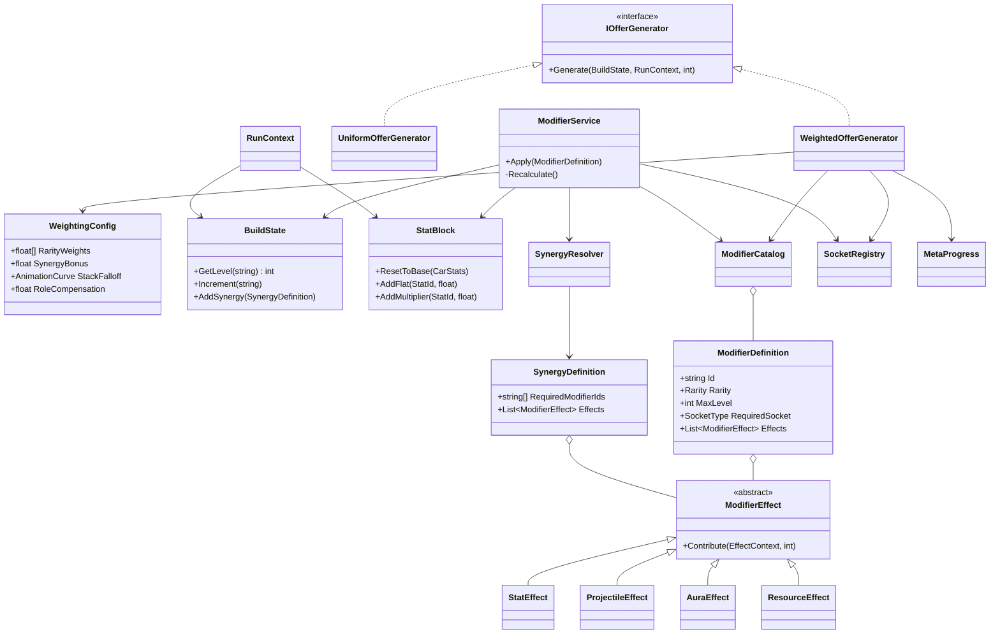
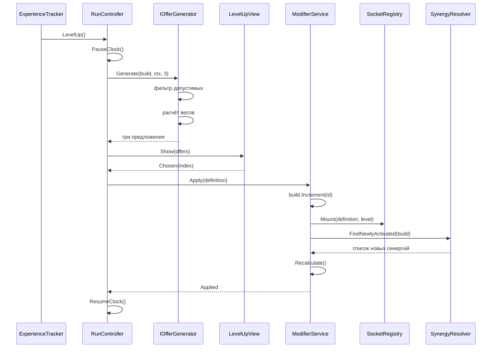

# Архитектура системы модификаторов

Проектная документация к этапу 5 плана работ. Материал раздела «Проектирование» пояснительной записки.

---

## 1. Требования к архитектуре

Система проектируется под четыре требования, вытекающие из темы работы:

1. **Добавление модификатора не требует программирования.** Новый баф — это новый ассет с настроенными полями. Из этого следует, что эффекты должны быть данными, а не наследниками с захардкоженной логикой.
2. **Алгоритм формирования предложений подменяем.** Экспериментальная часть сравнивает равновероятную и взвешенную выборку, значит генератор предложений обязан быть интерфейсом, а не методом внутри контроллера.
3. **Состояние пересчитывается, а не патчится.** Модификаторы накладываются друг на друга, повышают уровни и активируют синергии; инкрементальное изменение характеристик неизбежно приводит к расхождению значений. Пересчёт от базы при каждом изменении билда исключает этот класс ошибок.
4. **Система работает без сцены.** Симулятор прогоняет тысячи заездов headless, поэтому логика выбора и применения модификаторов не должна зависеть от отрисовки, ввода и `MonoBehaviour`-жизненного цикла.

---

## 2. Слои

| Слой | Содержимое | Зависит от |
| --- | --- | --- |
| Данные | `ModifierDefinition`, `SynergyDefinition`, `WeightingConfig`, `CarDefinition` — ассеты `ScriptableObject` | ничего |
| Состояние заезда | `BuildState`, `StatBlock`, `RunContext` — обычные C#-классы | данных |
| Логика | `ModifierService`, `IOfferGenerator`, `SynergyResolver`, `ModifierCatalog` | данных и состояния |
| Представление | `SocketRegistry`, `LevelUpView`, `WeaponMount` — `MonoBehaviour` | логики |
| Мета | `MetaProgress`, `SaveService` — разблокированный пул, покупки | данных |

Направление зависимостей — строго вниз. Слой логики не обращается к представлению напрямую, а публикует события; это и обеспечивает работу симулятора, где слой представления отсутствует.

---

## 3. Данные

### 3.1. Перечисления

```csharp
public enum ModifierCategory { Offensive, Elemental, Defensive }
public enum Rarity          { Common, Rare, Epic }
public enum SocketType      { None, Roof, Hood, Side, Exhaust, Bumper }
public enum StatId          { Damage, FireRate, MaxHealth, FuelCapacity,
                              FuelDrain, Speed, Mass, PickupRadius }
```

### 3.2. Описание модификатора

```csharp
[CreateAssetMenu(fileName = "Modifier", menuName = "RogueDrive/Modifier")]
public class ModifierDefinition : ScriptableObject
{
    public string Id;
    public string DisplayName;
    [TextArea] public string Description;
    public Sprite Icon;

    public ModifierCategory Category;
    public Rarity Rarity;
    [Min(1)] public int MaxLevel = 3;

    public SocketType RequiredSocket = SocketType.None;
    public GameObject[] LevelPrefabs;      // индекс = уровень - 1

    public SynergyTag[] Tags;

    [SerializeReference] public List<ModifierEffect> Effects = new();
}
```

Поле `Effects` помечено `[SerializeReference]`: это позволяет хранить в одном ассете список разнотипных эффектов как обычные сериализуемые C#-классы, без создания отдельного ассета на каждый эффект. Отсутствие `RequiredSocket` означает пассивный модификатор, не занимающий место на корпусе.

### 3.3. Эффекты

Базовый тип с единственной операцией — вкладом в пересчёт состояния:

```csharp
[Serializable]
public abstract class ModifierEffect
{
    public abstract void Contribute(EffectContext ctx, int level);
}
```

Конкретные типы:

```csharp
[Serializable]
public sealed class StatEffect : ModifierEffect
{
    public StatId Target;
    public AnimationCurve AdditivePerLevel;
    public AnimationCurve MultiplierPerLevel;

    public override void Contribute(EffectContext ctx, int level)
    {
        ctx.Stats.AddFlat(Target, AdditivePerLevel.Evaluate(level));
        ctx.Stats.AddMultiplier(Target, MultiplierPerLevel.Evaluate(level));
    }
}

[Serializable]
public sealed class ProjectileEffect : ModifierEffect
{
    public int BounceCount;
    public float SlowFactor;
    public float BurnDamage;

    public override void Contribute(EffectContext ctx, int level)
        => ctx.Projectiles.Add(this, level);
}

[Serializable]
public sealed class AuraEffect : ModifierEffect
{
    public string BehaviourId;             // огненный след, пилы, щит
    public AnimationCurve RadiusPerLevel;
    public AnimationCurve TickDamagePerLevel;

    public override void Contribute(EffectContext ctx, int level)
        => ctx.Behaviours.Enable(BehaviourId,
                                 RadiusPerLevel.Evaluate(level),
                                 TickDamagePerLevel.Evaluate(level));
}

[Serializable]
public sealed class ResourceEffect : ModifierEffect
{
    public int KillsPerTrigger;
    public AnimationCurve FuelRestoredPerLevel;

    public override void Contribute(EffectContext ctx, int level)
        => ctx.Resources.RegisterKillTrigger(KillsPerTrigger,
                                             FuelRestoredPerLevel.Evaluate(level));
}
```

Двенадцать модификаторов из README собираются комбинациями этих четырёх типов. Пятый тип понадобится, только если появится принципиально новый класс поведения.

### 3.4. Синергия

```csharp
[CreateAssetMenu(fileName = "Synergy", menuName = "RogueDrive/Synergy")]
public class SynergyDefinition : ScriptableObject
{
    public string Id;
    public string DisplayName;
    public string[] RequiredModifierIds;   // условие активации
    [SerializeReference] public List<ModifierEffect> Effects = new();
}
```

### 3.5. Конфигурация взвешивания

Ассет, коэффициенты которого варьируются в эксперименте:

```csharp
[CreateAssetMenu(fileName = "Weighting", menuName = "RogueDrive/Weighting Config")]
public class WeightingConfig : ScriptableObject
{
    public float[] RarityWeights = { 1.00f, 0.45f, 0.15f };  // w_base
    public float SynergyBonus = 2.5f;                        // k_syn
    public AnimationCurve StackFalloff;                      // k_stack от уровня
    public float RoleCompensation = 1.8f;                    // k_role
    public float LowResourceThreshold = 0.35f;
}
```

---

## 4. Состояние заезда

```csharp
public sealed class BuildState
{
    readonly Dictionary<string, int> _levels = new();
    readonly List<SynergyDefinition> _synergies = new();

    public IReadOnlyDictionary<string, int> Levels => _levels;
    public IReadOnlyList<SynergyDefinition> ActiveSynergies => _synergies;

    public int  GetLevel(string id) => _levels.TryGetValue(id, out var l) ? l : 0;
    public bool Has(string id)      => GetLevel(id) > 0;
    public void Increment(string id) => _levels[id] = GetLevel(id) + 1;
    public void AddSynergy(SynergyDefinition s) => _synergies.Add(s);
}
```

`StatBlock` хранит для каждой характеристики базовое значение, сумму плоских прибавок и произведение множителей, отдавая итог по запросу. `RunContext` агрегирует ссылки на `BuildState`, `StatBlock`, текущие ресурсы (HP, топливо), пройденную дистанцию и номер уровня — это то, что видит генератор предложений.

---

## 5. Генерация предложений

Интерфейс, подмена которого и составляет суть эксперимента:

```csharp
public interface IOfferGenerator
{
    IReadOnlyList<ModifierDefinition> Generate(BuildState build, RunContext ctx, int count);
}
```

Две реализации: `UniformOfferGenerator` — равновероятная выборка среди допустимых (контрольная группа), и `WeightedOfferGenerator` — предлагаемый алгоритм.

```csharp
public sealed class WeightedOfferGenerator : IOfferGenerator
{
    readonly ModifierCatalog _catalog;
    readonly WeightingConfig _cfg;
    readonly SocketRegistry  _sockets;
    readonly MetaProgress    _meta;

    public IReadOnlyList<ModifierDefinition> Generate(
        BuildState build, RunContext ctx, int count)
    {
        var pool = new List<ModifierDefinition>();
        var weights = new List<float>();

        foreach (var m in _catalog.All)
        {
            if (!IsEligible(m, build)) continue;
            pool.Add(m);
            weights.Add(Weight(m, build, ctx));
        }
        return WeightedSampleWithoutReplacement(pool, weights, count);
    }

    bool IsEligible(ModifierDefinition m, BuildState build)
    {
        if (!_meta.IsUnlocked(m.Id)) return false;

        int level = build.GetLevel(m.Id);
        if (level >= m.MaxLevel) return false;

        // новый модификатор требует свободного сокета, повышение уровня — нет
        if (level == 0 && m.RequiredSocket != SocketType.None
                       && !_sockets.HasFree(m.RequiredSocket)) return false;

        return true;
    }

    float Weight(ModifierDefinition m, BuildState build, RunContext ctx)
    {
        float w = _cfg.RarityWeights[(int)m.Rarity];
        w *= _cfg.StackFalloff.Evaluate(build.GetLevel(m.Id));

        if (ClosesSynergy(m, build))       w *= _cfg.SynergyBonus;
        if (CompensatesWeakness(m, ctx))   w *= _cfg.RoleCompensation;

        return w;
    }
}
```

`ClosesSynergy` проверяет, существует ли определение синергии, все требования которого выполняются билдом при добавлении кандидата. `CompensatesWeakness` возвращает истину для защитных и ресурсных модификаторов, когда доля прочности или топлива опустилась ниже `LowResourceThreshold`, а в билде нет модификаторов соответствующей категории.

Приведение `WeightingConfig` к нейтральным значениям (`SynergyBonus = 1`, `RoleCompensation = 1`, плоская `StackFalloff`) превращает взвешенный генератор в равновероятный. Это даёт непрерывный ряд промежуточных конфигураций между контрольной и экспериментальной группами, что и требуется для построения графиков.

---

## 6. Применение модификатора

```csharp
public sealed class ModifierService
{
    public event Action<ModifierDefinition, int> Applied;
    public event Action<SynergyDefinition>       SynergyActivated;

    public void Apply(ModifierDefinition def)
    {
        _build.Increment(def.Id);
        int level = _build.GetLevel(def.Id);

        if (def.RequiredSocket != SocketType.None)
            _sockets.Mount(def, level);          // занять сокет либо заменить префаб

        foreach (var s in _synergyResolver.FindNewlyActivated(_build))
        {
            _build.AddSynergy(s);
            SynergyActivated?.Invoke(s);
        }

        Recalculate();
        Applied?.Invoke(def, level);
    }

    void Recalculate()
    {
        _stats.ResetToBase(_car.BaseStats);
        _effectContext.Clear();

        foreach (var pair in _build.Levels)
            foreach (var effect in _catalog[pair.Key].Effects)
                effect.Contribute(_effectContext, pair.Value);

        foreach (var synergy in _build.ActiveSynergies)
            foreach (var effect in synergy.Effects)
                effect.Contribute(_effectContext, 1);
    }
}
```

`Recalculate` идемпотентна: результат зависит только от текущего состава билда, а не от порядка и истории применений. Повышение уровня модификатора не требует отдельной ветки кода — изменяется число в `BuildState`, и следующий пересчёт даёт новые значения.

---

## 7. Диаграмма классов



---

## 8. Сценарий выбора модификатора



В режиме симуляции из цепочки исключаются `LevelUpView` и пауза: `RunController` обращается к `ISimulationAgent`, который возвращает индекс выбора по заданной стратегии. Остальные звенья работают без изменений — именно поэтому измеряется та же система, что и играется.

---

## 9. Сокеты

```csharp
public sealed class SocketRegistry : MonoBehaviour
{
    [SerializeField] SocketSlot[] _slots;   // тип + Transform, задаются на префабе машины

    public bool HasFree(SocketType type);
    public void Mount(ModifierDefinition def, int level);
}
```

`Mount` при первом применении занимает свободный слот нужного типа и инстанцирует `LevelPrefabs[0]`; при повышении уровня заменяет модель на `LevelPrefabs[level - 1]` в том же слоте. Слоты объявляются на префабе автомобиля, поэтому число сокетов является характеристикой архетипа и настраивается без кода.

---

## 10. Точки подключения эксперимента

| Что подменяется | Интерфейс | Реализации |
| --- | --- | --- |
| Алгоритм предложений | `IOfferGenerator` | `UniformOfferGenerator` (контроль), `WeightedOfferGenerator` (эксперимент) |
| Решения игрока | `ISimulationAgent` | `RandomAgent`, `PriorityAgent`, `SynergySeekingAgent` |
| Течение заезда | `IRunModel` | `AnalyticRunModel` |
| Случайные числа | `IRandomSource` | `SeededRandom` |
| Доступность модификаторов | `IUnlockProvider` | `AllUnlocked`, далее мета-прогресс |

Конфигурация серии задаётся ассетом `SimulationBatch`: каталог, автомобиль, профиль сложности, перечень сравниваемых вариантов `WeightingConfig`, набор стратегий игрока, число повторов и базовое зерно. Каждый прогон получает три независимых потока случайных чисел, производных от одного зерна (отбор предложений, модель заезда, решения агента), поэтому серия воспроизводится побитово — требование к экспериментальной части.

Выгрузка `SimulationRunner` формирует три файла: построчные результаты прогонов, сводные метрики по каждой конфигурации и частоты выбора модификаторов.

### Граница достоверности модели

Изучаемая часть системы в симуляции та же, что и в игре: используются те же каталог, генератор предложений, резолвер синергий и сервис применения. Заменяется только течение боя — вместо сцены работает `AnalyticRunModel`, пошагово рассчитывающая урон, потери и расход ресурсов по характеристикам из `StatBlock`.

Это осознанное упрощение, и в записке оно оговаривается прямо: модель воспроизводит влияние модификаторов на исход заезда, но не пространственную составляющую (конкретное расположение препятствий по полосам, качество маневрирования). Интерфейс `IRunModel` оставляет возможность подставить прогон настоящей сцены на ускоренном времени и сопоставить результаты — такая проверка согласованности планируется на меньшей выборке.

### Метрики

`BuildStatistics` рассчитывает по серии: долю завершённых заездов, медиану и стандартное отклонение дистанции, долю заездов с собранной синергией, число различных билдов и энтропию Шеннона их распределения. Нормированная энтропия и доля синергий — две величины ключевого компромисса работы: усиление взвешивания повышает вторую и снижает первую, а искомая область настроек лежит там, где обе приемлемы.

---

## 11. Проверка требования «без программирования»

Добавление модификатора «Шипованные колёса», наносящего урон при боковом контакте:

1. Создать ассет через `Assets → Create → RogueDrive → Modifier`.
2. Заполнить поля: идентификатор, категория `Offensive`, редкость `Rare`, максимальный уровень 3, сокет `Side`.
3. Назначить три префаба моделей колёс — по одному на уровень.
4. Добавить в `Effects` элемент `AuraEffect` с идентификатором поведения `side_contact` и кривыми радиуса и урона.
5. Проставить теги синергии.

Кода не написано. Модификатор автоматически попадает в пул, участвует во взвешивании, монтируется в сокет и учитывается в пересчёте характеристик. Этот сценарий приводится в записке как подтверждение выполнения требования 1 из раздела 1.

---

## 12. Что из этого идёт в пояснительную записку

* Раздел 1 — обоснование архитектурных решений (требования и следствия из них).
* Раздел 7 — диаграмма классов.
* Раздел 8 — диаграмма последовательности.
* Раздел 5 — описание алгоритма взвешивания с формулой и листингом.
* Раздел 10 — методика эксперимента, обоснование воспроизводимости.
* Раздел 11 — подтверждение расширяемости системы.
