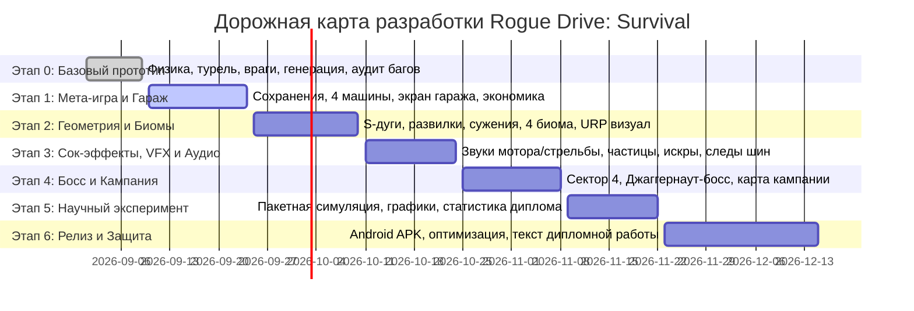

# План разработки проекта «Rogue Drive: Survival»
## Дипломный проект (БГУИР) — Разработка мобильной survival-racing игры с элементами Action Roguelite

---

## 1. Введение и цели проекта

### 1.1. Практическая цель
Разработка полноценной мобильной 3D-игры в жанре **Survival Racing / Action Roguelite** на движке **Unity 6 LTS**, объединяющей свободную аркадную физику вождения (*Earn to Die*), автоматическую круговую стрельбу с физическими сокетами монтажа оружия и сессионную сборку билдов из модификаторов (*Vampire Survivors / Brotato*).

### 1.2. Научно-практическая новизна дипломного исследования
1. **Гибридная модель прогрессии:** синергия между долгосрочной мета-прогрессией в гараже (улучшение узлов шасси) и динамическим роглайт-драфтом модификаторов в заезде.
2. **Физическая сокетная архитектура вооружения:** модификаторы не просто меняют числовые параметры формул, а монтируют 3D-модули в анатомические слоты кузова с ограничениями по типам сокетов.
3. **Автоматизированный измерительный стенд балансировки:** бессерверная / безграфическая симуляция тысяч заездов (headless Monte Carlo simulation) для математической оценки разнообразия билдов (энтропия Шеннона, коэффициент Джини, кривые выживаемости).

---

## 2. Общая дорожная карта разработки (Milestones)

---

## 3. Детализация этапов

### Этап 0: Фундамент и рабочий прототип игрового цикла (ЗАВЕРШЁН ✅)
* **Статус:** 100% выполнено, верифицировано и закоммичено в репозиторий.
* **Реализовано:**
  * Свободная аркадная физика автомобиля на Rigidbody с прижимной силой и боковым сцеплением ([`ArcadeCarController.cs`](Assets/Scripts/Gameplay/ArcadeCarController.cs)).
  * 360° авто-турель на крыше с расчётом упреждения и пулом снарядов ([`AutoTurret.cs`](Assets/Scripts/Gameplay/Combat/AutoTurret.cs)).
  * 4 архетипа противников (Зомби, Бегун, Бронированный громила, Кислотный плевака).
  * Сферы опыта с магнитным притяжением к автомобилю ([`ExperienceGem.cs`](Assets/Scripts/Gameplay/Experience/ExperienceGem.cs)).
  * Экран выбора «1 из 3» модификаторов с подсветкой синергий и рероллом ([`LevelUpView.cs`](Assets/Scripts/Gameplay/UI/LevelUpView.cs)).
  * Бесшовная процедурная генерация дороги и волн врагов ([`ProceduralTrackGenerator.cs`](Assets/Scripts/Gameplay/Track/ProceduralTrackGenerator.cs)).
  * Контроллер активных аур вокруг машины ([`CarAuraController.cs`](Assets/Scripts/Gameplay/Combat/CarAuraController.cs)).
  * Устранены все 13 выявленных багов физики, урона и утечек памяти.

---

### Этап 1: Мета-прогрессия, Гараж и Автопарк (Недели 1–2)
**Цель:** Создать долгосрочный цикл удержания игрока в духе *Earn to Die*.

#### Задачи:
1. **Система сохранений и сериализации (`SaveService`):**
   * Локальное шифрованное сохранение в JSON (`Application.persistentDataPath`): баланс монет, открытые автомобили, уровни прокачки модулей, рекорды дистанции.
   * Обработка первого запуска, сброс прогресса для тестирования.
2. **Реализация 4 архетипов автомобилей:**
   * **Седан («Скиталец»):** стартовая сбалансированная машина (базовые сокеты: Крыша, Капот).
   * **Фургон («Транзит»):** увеличенный бак, высокая живучесть (сокеты: Крыша, Капот, Боковины).
   * **Внедорожник («Мародёр»):** высокая масса, мощный таранный бампер (сокеты: Крыша, Бампер, Боковины).
   * **Броневик («Бастион»):** максимальная броня, 5 сокетов монтажа вооружения.
3. **6 веток модернизации каждого автомобиля:**
   * Двигатель (максимальная скорость и ускорение);
   * Трансмиссия / КПП (эффективность нитро);
   * Топливный бак (запас топлива на заезд);
   * Броня кузова (максимальное HP и снижение урона от тарана);
   * Колёса / Шины (сцепление на поворотах, проходимость);
   * Орудийная турель (базовый урон и скорострельность).
4. **Интерфейс Гаража (Garage UI):**
   * 3D-подиум с вращением выбранного автомобиля;
   * Карточки апгрейдов с индикатором уровней (1..5) и стоимостью;
   * Отображение баланса монет и кнопка выхода на трассу («В ЗАЕЗД»).

#### Результат этапа:
Игрок зарабатывает монеты в заезде, возвращается в гараж, улучшает узлы машины или покупает новую, после чего ощутимо продвигается дальше по дистанции.

---

### Этап 2: Извилистая трасса, развилки и биомы (Недели 3–5)
**Цель:** Реализовать разнообразие геометрии уровней в соответствии с дизайн-документом (исключить монотонную езду по прямой).

#### Задачи:
1. **Модульная система криволинейных чанков:**
   * Плавные повороты (S-Curves) влево и вправо с расчётом центробежной силы;
   * Бутылочные горлышки (узкие мосты, разрушенные эстакады с высокими бортами);
   * Развилки (Fork Chunks): тактический выбор между широким извилистым объездом и узким прямым участком с плотной ордой мутантов.
2. **4 визуальных биома постапокалипсиса:**
   * **Биом 1: Пригород и брошенное шоссе** (асфальт, ржавые ограждения, остовы легковушек);
   * **Биом 2: Песчаная пустошь / Каньон** (пыльная буря, песчаные заносы, взрывные бочки);
   * **Биом 3: Затопленная промзона / Эстакады** (токсичные лужи, узкие проезды между цехами);
   * **Биом 4: Подступы к Безопасному Городу** (баррикады, военные КПП, завалы).
3. **Интерактивные объекты трассы:**
   * Взрывные бочки с физическим разлётом обломков и цепной детонацией;
   * Разрушаемые деревянные ящики с бонусами монет и канистрами топлива.

#### Результат этапа:
Динамичная процедурная трасса с развилками, препятствиями и визуальной сменой окружения по мере продвижения по кампании.

---

### Этап 3: Сочность (Juiciness), VFX, Шейдеры и Аудио (Недели 6–7)
**Цель:** Довести тактильный отклик и аудиовизуальное восприятие до коммерческого уровня.

#### Задачи:
1. **Звуковое оформление (Audio Manager):**
   * Процедурный или многослойный звук двигателя автомобиля с изменением питча от оборотов/скорости;
   * Свист турбины и рёв нитро-ускорителя;
   * Звуки выстрелов турели, рикошетов и взрывов;
   * Визг шин при боковом заносе и скрежет металла при таране отбойников;
   * Саундтрек в жанре постапокалиптического синтвейва / индастриал-рока.
2. **Система частиц (VFX / Shuriken / VFX Graph):**
   * Выхлопной дым и пламя из труб при нитро;
   * Следы пробуксовки шин на асфальте (Skidmarks / TrailRenderer);
   * Вспышки выстрелов из дула (Muzzle Flash) и искры при рикошетах;
   * Эффекты аур: полоса огня за машиной, крутящиеся пилы, электрические дуги цепной молнии;
   * Эффектный взрыв машины со Slow-Mo и разлётом запчастей при 0 HP.
3. **Пост-процессинг и освещение:**
   * Настройка Universal Render Pipeline (URP): Bloom для лазеров и фар, Color Adjustments, виньетка при низком HP.

#### Результат этапа:
Эффектная, визуально сочная и звучащая игра с мгновенным откликом на действия игрока.

---

### Этап 4: Финальный босс, элитные враги и кампания (Недели 8–10)
**Цель:** Завершить структуру кампании из 4 секторов с кульминационной битвой.

#### Задачи:
1. **Элитные модификаторы врагов:**
   * Элитные ауры врагов (Череп-иконка): ускоренные бегуны, взрывающиеся кислотные камикадзе.
2. **Битва с боссом 4-го сектора («Джаггернаут-перехватчик»):**
   * Фаза 1: Преследование тяжёлого броневика босса, уклонение от сбрасываемых мин;
   * Фаза 2: Босс разворачивается и таранит игрока лоб в лоб, призывая волны миньонов;
   * Фаза 3: Отстрел уязвимых точек (двигатель, турели) и финальный таран.
3. **Глобальная карта кампании:**
   * Линейная карта с 4 узлами секторов и отображением рекорда дистанции;
   * Экран победы кампании (эвакуация на вертолёте из Безопасного Города);
   * Режим бесконечного выживания (Endless Run) для соревновательного рекорда.

#### Результат этапа:
Законченный сценарий сюжетной кампании с внятным финалом и высокой реиграбельностью.

---

### Этап 5: Научно-исследовательский модуль симуляции для диплома (Недели 11–12)
**Цель:** Получить строгие научные результаты, графики и таблицы для расчетно-пояснительной записки диплома БГУИР.

#### Задачи:
1. **Пакетная headless-симуляция (Monte Carlo CLI):**
   * Прогон $10\,000$ заездов с разными конфигурациями весов модификаторов (`Equal`, `SynergyBiased`, `AggressiveReroll`);
   * Сбор метрик: выживаемость, энтропия выбора модификаторов, коэффициент использования сокетов, время сборки синергий.
2. **Экспорт и визуализация данных:**
   * Автоматическая выгрузка данных в CSV / JSON;
   * Построение графиков баланса в Python (Matplotlib / Seaborn) для дипломной записки:
     * Распределение финальных дистанций (гистограммы и box-plot);
     * График популярности билдов (доказательство отсутствия доминирующей «имбы»);
     * Коэффициент Джини для разнообразия используемых слотов.
3. **Оформление научной главы диплома:**
   * Математическое описание модели вероятностного драфта;
   * Анализ результатов машинного эксперимента.

#### Результат этапа:
Готовые графики, таблицы, математические выкладки и текст 2-й и 3-й глав дипломной работы.

---

### Этап 6: Мобильная сборка, профилирование и защита диплома (Недели 13–15)
**Цель:** Подготовка релизного Android APK, оформление пояснительной записки и презентации.

#### Задачи:
1. **Адаптация под сенсорный ввод:**
   * Экранные плавающие педали газа/тормоза, кнопки руления и кнопка нитро;
   * Поддержка гироскопа (по желанию в настройках).
2. **Оптимизация производительности (Mobile Profiling):**
   * Профилирование в Unity Profiler (CPU/GPU, GC Allocations);
   * Стабильные 60 FPS на среднебюджетных смартфонах Android;
   * Снижение Draw Calls за счёт GPU Instancing и статического батчинга чанков дороги.
3. **Релизный билд:**
   * Сборка подписанного Android APK / AAB в Unity 6 LTS.
4. **Подготовка дипломных материалов:**
   * Оформление пояснительной записки по стандартам БГУИР (ГОСТ);
   * Подготовка раздаточного материала, презентации и демонстрационного видеоролика заезда.

---

## 4. Матрица соответствия структуре дипломной работы БГУИР

| Глава дипломной работы | Техническая реализация в проекте |
|------------------------|----------------------------------|
| **Введение** | Цели, задачи, актуальность жанра Action Roguelite на мобильных платформах. |
| **Глава 1. Аналитический обзор** | Сравнение существующих решений (*Earn to Die*, *Vampire Survivors*, *Brotato*, *Crossout*), выбор движка Unity 6 LTS, URP и архитектурного паттерна Data-Driven Design. |
| **Глава 2. Архитектура и математическая модель** | Модель сокетного монтажа вооружения, вероятностный граф модификаторов, формулы урона, модель симуляции баланса. |
| **Глава 3. Программная реализация** | Описание разработанных подсистем: `ArcadeCarController`, `AutoTurret`, `ProceduralTrackGenerator`, `CarAuraController`, `SaveService`, `LevelUpView`. |
| **Глава 4. Экспериментальные исследования** | Результаты прогона $10\,000$ заездов в симуляторе, графики энтропии билдов, оценка баланса и выводы. |
| **Заключение** | Основные результаты, достижение поставленных целей, перспективы развития. |

---

## 5. Ближайшие шаги (План на текущий спринт)

1. [x] Разработка и отладка физического прототипа с авто-турелью и процедурной трассой.
2. [x] Устранение всех критических багов механики, памяти и урона.
3. [ ] **Задача 1.1:** Создать сервис сохранений [`SaveService.cs`](Assets/Scripts/Meta/SaveService.cs) и контейнер данных мета-прогресса (монеты, купленные улучшения).
4. [ ] **Задача 1.2:** Создать сцену и интерфейс Гаража с возможностью прокачки узлов Седана за монеты.
5. [ ] **Задача 1.3:** Связать начисление монет в конце заезда с балансом игрока в гараже.
