# Rogue Drive Survival - контекст геймдизайна

Этот файл является журналом согласованных решений по концепции игры. Его нужно обновлять после каждого уточнения концепта.

## Зафиксированные решения

| Область | Решение |
| --- | --- |
| Рабочее название | Rogue Drive: Survival |
| Жанр | Survival Racing с элементами Action Roguelite |
| Платформы | Android и iOS |
| Движок и версия | Unity 6 LTS (6000.0.57f1), C# |
| Целевая аудитория и рейтинг | 12+ (PG-13): аркадный экшен, стилизованные взрывы, искры, отлетающие запчасти без излишней крови и расчленёнки |
| Визуальный стиль | Стилизованный Low-Poly / Mid-Poly: чистая читаемая картинка, стабильный FPS на мобильных устройствах, высокая доступность ассетов из Unity Asset Store |
| Камера и ракурс | Аркадная динамическая камера сзади-сверху (Cinemachine Third-Person): висит сзади-сверху под углом ~25–30°, с динамическим отдалением и расширением FOV на нитро/высокой скорости для отличного обзора дороги далеко вперёд |
| Геометрия трассы | Извилистая трасса с развилками и сужениями: дорога плавно петляет (S-образные дуги), имеет развилки (короткий опасный прорыв сквозь плотную толпу vs более безопасный объезд) и бутылочные горлышки (узкие мосты, завалы). Исключено ощущение «тупо ехать прямо» |
| Языки первого релиза | Русский и английский |
| Модель монетизации | Free-to-play: внутриигровые покупки (наборы монет, отключение рекламы) и добровольная реклама |
| Разработка | Один разработчик, учебный дипломный проект |
| Главный герой и сюжет | Безымянный выживший. Цель кампании — пробиться через 4 опасных сектора к Безопасному Городу для эвакуации |
| Мир | Смешанный постапокалипсис: окраины разрушенного города, скоростное шоссе, пустыня, мост / промзона, безопасный город |
| Основной режим | Кампания из 4 фиксированных маршрутов от точки А до точки Б |
| Дополнительный режим | Непрерывный заезд (Endless) без финиша — измерительный стенд для балансировки и режим на рекорд дистанции |
| Длительность заезда | 3–4 минуты на один успешный заезд кампании (динамичный мобильный сессионный формат) |
| Управление автомобилем | Свободное аркадное руление по широкой дороге (Rigidbody + Raycast), экранные педали газа/тормоза, руление и кнопка нитро |
| Механика нитро | Шкала с автоматическим накоплением со временем и за уничтожение врагов; активируется кнопкой для резкого рывка, тарана и ухода от толпы |
| Условия завершения заезда | При 0 топлива — плавный накат машины по инерции до полной остановки (позволяет докатиться до сфер/финиша); при 0 HP — эффектный взрыв с замедлением времени (Slow-Mo) перед экраном итогов |
| Базовая боевая система | Автоматическая турель на крыше машины вращается на 360° и непрерывно атакует ближайшего врага в радиусе поражения |
| Контактный бой и таран | Таран разрешён: слабые враги гибнут от удара, столкновение с тяжелыми врагами и баррикадами снижает скорость и наносит урон машине |
| Препятствия и интерактивные объекты | Взрывные бочки (наносят урон врагам и авто при детонации), остовы разбитых машин (тяжелые препятствия для тарана/объезда) и разрушаемые ящики с ресурсами |
| Пул противников | 1) Обычный зомби (контактный, слабая угроза, сбивается на скорости); 2) Быстрый мутант-бегун (настигает с флангов и атакует борта); 3) Бронированный громила (тяжелый контактный противник, резко тормозит машину); 4) Зомби-плевака / Кислотный мутант (дистанционный противник, стреляет сгустками кислоты с обочин) |
| Финальный босс (блокиратор 4 уровня) | Бронированный блокпост / Тяжёлый джаггернаут-перехватчик: перекрывает дорогу, имеет полосу HP, призывает волны миньонов, уничтожается турелью и прицельным тараном уязвимых точек |
| Система сокетов (слотов) | Физические точки монтажа 3D-моделей оружия на кузове машины (крыша, капот, борта, бампер, выхлоп). Пассивные модификаторы сокетов не занимают. Составляет ключевую научную новизну диплома |
| Архетипы автомобилей | Четыре автомобиля: Седан (базовый, сбалансированный), Фургон (большой бак), Внедорожник (масса и таран), Броневик (максимальная броня и вместимость сокетов) |
| Прогрессия автомобилей | У каждой машины 6 направлений улучшения по 5 уровней (броня, бак, турель, трансмиссия, двигатель, шины). Новая машина в базе равна предыдущей на 70–80% прокачки и превосходит её после 2–3 улучшений |
| Открытие и покупка машин | Локационная привязка: завершение локации открывает возможность купить следующий автомобиль за накопленные монеты в гараже (модель *Earn to Die*) |
| Стартовый автомобиль | Легковой седан выдается игроку бесплатно в начале игры |
| Два слоя прогрессии | Постоянная прокачка в гараже (Earn to Die) + сессионные бафы во время заезда (Archero / Vampire Survivors) |
| Сбор опыта | Уничтоженные враги оставляют сферы опыта, которые автоматически подбираются в радиусе вокруг машины; радиус увеличивается модификатором магнита |
| Выбор модификаторов | 5–7 выборов за заезд. При заполнении шкалы опыта игра ставится на паузу; всплывает оверлей с 3 карточками модификаторов (иконка, редкость, описание, подсветка синергий) |
| Стакинг модификаторов | Повторный выбор уже установленного модификатора повышает его уровень (до 3 ур.) вместо занятия нового физического сокета |
| Правило рекламы | Полное отсутствие принудительной рекламы. Доступно 1 продолжение заезда после гибели (30% HP, 15% топлива) и 1 обновление тройки карт за просмотр ролика |
| Экономика | Монеты зарабатываются за пройденную дистанцию, уничтоженных врагов, разбитые ящики и финиш маршрута. Первое прохождение локации даёт бонус в размере ~2 средних заездов |

## Подтверждённые гипотезы (перенесены в зафиксированные решения)

* [x] **Длительность сессии:** зафиксировано оптимальное значение 3–4 минуты на успешный заезд (динамичный мобильный темп без монотонности).
* [x] **Типы угроз:** подтверждено сочетание контактных врагов (обычный, бегун, громила) и дистанционных (кислотный плевака).
* [x] **Роль сокетов:** подтверждена как ключевая научная новизна проекта (модификатор не только меняет формулы, но и физически инстанцирует 3D-пушку в свободный сокет кузова).
* [x] **Геометрия трассы:** отказ от прямолинейного рельсового движения — трасса извилистая, с развилками и тактическим выбором траекторий.

## Открытые вопросы

> [!NOTE]
> Все 10 ранее открытых вопросов концепта игры **полностью решены и зафиксированы** в таблице решений выше.
> Ниже приведена сводка их закрытия:

1. **Целевая аудитория и возрастной рейтинг:** Решено $\rightarrow$ 12+ (PG-13), аркадный визуальный тон без расчленёнки.
2. **Визуальный стиль и настроение мира:** Решено $\rightarrow$ Стилизованный Low-Poly / Mid-Poly постапокалипсис.
3. **Главная цель кампании и сюжет:** Решено $\rightarrow$ Эвакуация из Безопасного Города в конце 4-го сектора.
4. **Структура карты кампании:** Решено $\rightarrow$ 4 региона на глобальной карте, линейное открытие с возможностью повторных заездов для фарма.
5. **Правило открытия и покупки авто:** Решено $\rightarrow$ Открытие машины по завершении соответствующей локации, покупка за монеты в гараже.
6. **Полный список ресурсов и их получение:** Решено $\rightarrow$ Монеты (дистанция/киллы/бонусы/ящики), Опыт (сферы за киллы), Топливо и HP (живучесть авто), Нитро (накапливаемая шкала).
7. **Роль и механика финального блокиратора 4 локации:** Решено $\rightarrow$ Бронированный блокпост / Тяжёлый джаггернаут-перехватчик с полосой здоровья и волнами миньонов.
8. **Награда за первое прохождение локации:** Решено $\rightarrow$ Разовый крупный бонус монет (~2 средних заезда).
9. **Состав внутриигровых покупок и рекламы:** Решено $\rightarrow$ IAP (монеты, No Ads), добровольная реклама (1 реролл бафов, 1 воскрешение с 30% HP / 15% топлива).
10. **Список автомобилей, врагов, боссов и модификаторов:** Решено $\rightarrow$ 4 авто (Седан, Фургон, Внедорожник, Броневик), 4 врага (Зомби, Бегун, Громила, Кислотный плевака), 1 финальный босс, 12 модификаторов сокетов/эффектов.

## Журнал изменений

| Дата | Решение |
| --- | --- |
| 2026-09-09 | Зафиксирована кампания из точки А в точку Б, ориентированная на прогрессию автомобилей в духе Earn to Die. |
| 2026-09-09 | Определены герой, цель кампании, управление, боевая основа и четыре начальных архетипа автомобилей. |
| 2026-09-09 | Принято решение о свободном аркадном рулении по широкой дороге. Фиксированные полосы исключены. |
| 2026-09-09 | Первая версия кампании ограничена четырьмя уровнями. Награда начисляется за убийства и дистанцию даже при поражении. |
| 2026-09-09 | Постоянная прокачка Earn to Die и сессионные бафы Archero работают одновременно, но на разных уровнях прогрессии. |
| 2026-09-09 | Зафиксировано целевое правило баланса топлива: максимального бака достаточно для прохождения локации. |
| 2026-09-09 | Опыт подбирается автоматически в радиусе автомобиля. |
| 2026-09-09 | Подтверждена добровольная рекламная модель: 1 продолжение за заезд (30% HP, 15% топлива) и 1 реролл модификаторов. |
| 2026-09-09 | Подтверждено правило баланса новой машины: база равна 70–80% прокачки прежней машины. |
| 2026-09-09 | **(Сессия уточнения)** Утверждён возрастной рейтинг 12+ (аркадные эффекты, взрывы, искры без излишней жестокости). |
| 2026-09-09 | **(Сессия уточнения)** Выбран визуальный стиль: стилизованный Low-Poly / Mid-Poly постапокалипсис. |
| 2026-09-09 | **(Сессия уточнения)** Утверждена механика босса 4-й локации: Бронированный блокпост / Джаггернаут-перехватчик с полосой HP и спавном волн миньонов. |
| 2026-09-09 | **(Сессия уточнения)** Зафиксировано правило открытия машин: завершение локации открывает доступ к покупке в гараже за монеты. |
| 2026-09-09 | **(Сессия уточнения)** Утверждена логика базовой турели: вращение на 360° на крыше с авто-прицеливанием по ближайшему врагу. |
| 2026-09-09 | **(Сессия уточнения)** Зафиксировано поведение при поражении: при 0 топлива — накат по инерции; при 0 HP — взрыв со Slow-Mo перед экраном итогов. |
| 2026-09-09 | **(Сессия уточнения)** Подтверждена концепция сокетов (физические слоты оружия на кузове) как ключевая научная новизна диплома. |
| 2026-09-09 | **(Сессия уточнения)** Состав врагов расширен дистанционным типом: Зомби-плевака / Кислотный мутант с уклонением от снарядов кислоты. |
| 2026-09-09 | **(Сессия уточнения)** Утверждена механика нитро: шкала с авто-накоплением со временем и за уничтожение врагов, кнопка для рывка и тарана. |
| 2026-09-09 | **(Сессия уточнения)** Утверждён интерфейс прокачки: оверлей с 3 карточками способностей и подсветкой синергий при паузе заезда. |
| 2026-09-09 | **(Сессия уточнения)** Целевая длительность успешного заезда установлена в 3–4 минуты. |
| 2026-09-09 | **(Сессия уточнения)** На трассу добавлены взрывные бочки, остовы разбитых машин (таран) и разрушаемые ящики с ресурсами. |
| 2026-09-09 | **(Сессия геометрии и камеры)** Отклонено движение «тупо прямо»: утверждены извилистые S-образные участки дороги, развилки путей и бутылочные горлышки. |
| 2026-09-09 | **(Сессия геометрии и камеры)** Утверждена динамическая камера Cinemachine Third-Person (сзади-сверху, наклон ~25–30°, динамический FOV на скорости/нитро). |
| 2026-09-10 | **(Архитектура и диплом)** Полный отказ от скриптов автогенерации уровней/сцен (`StageScenesBuilder`, `StageSceneDresser` и др. удалены) в пользу ручного модульного левел-дизайна (Blender + Unity). |
| 2026-09-10 | **(Сюжет и катсцена)** Утвержден пролог: пробуждение героя от помех рации, сообщение Цитадели о скором закрытии шлюзов («Протокол Закат»). Бесшовный переход в геймплей. |
| 2026-09-10 | **(Стартовый бункер)** Архитектура стартовой базы: подземное укрытие, дизель-генератор питания, двустворчатые распашные броневорота, наклонный пандус выезда на поверхность. |
| 2026-09-10 | **(Структура экспедиции)** Дорога разбита на 4 сектора с 3 промежуточными безопасными базами (СТО Пригорода, Лагерь рейдеров Пустоши, Ангар химзавода) и финальной Цитаделью. |
| 2026-09-10 | **(Поиск и починка авто)** На каждой промежуточной базе игрок находит законсервированный автомобиль следующего класса и восстанавливает/чинит его на месте. |
| 2026-09-10 | **(Интерактивная 3D-прокачка)** Прокачка узлов автомобиля реализована через физическое наведение взгляда (Raycast) от 1-го лица на капот, колеса, турель, бак и кузов прямо в 3D-сцене. |
| 2026-09-10 | **(Нарратив и атмосфера)** Атмосфера постапокалиптического одиночества (записки, радиограммы, отсутствие мирных NPC), единственный связной — диспетчер Цитадели («Маяк») по рации. |

---

## 3. Сюжетный сценарий и пролог (Зафиксировано 2026-09-10)

### 3.1. Вступительная катсцена: «Пробуждение»
1. **Звук и темнота (Черный экран):** Глухой гул подземного бункера, капли конденсата. Резкий треск радиоэфира (`*кххх-пшшш*`).
2. **Радиограмма Цитадели:** Прерывистый голос диспетчера:
   > *«Внимание всем уцелевшим бортам в квадрате 7... Активирован протокол консервации "Закат". Главный гермошлюз Цитадели запечатывается наглухо... Это последний шанс на эвакуацию. Повторяю, шлюз закрывается...»*
3. **Открытие глаз (Eye-blink effect):** Раздвижение черных полос, размытие сменяется фокусом на потолочные балки и мигающую красную лампу. Герой резко вскакивает с раскладушки в жилом углу.
4. **Титр-мысль героя:** *«Цитадель закрывает шлюзы... Если не успею прорваться — останусь гнить здесь навсегда. Надо валить!»*.

### 3.2. Архитектура стартового бункера (Укрытие 07)
* **Зона отдыха:** Раскладушка со спальником, тумбочка с шипящей рацией, календарь катастрофы.
* **Силовая зона:** Дизель-генератор. При активации (`[E]`) свет последовательно зажигается по всему бункеру, снимается блокировка с пульта ворот.
* **Зона ворот:** Двустворчатые распашные бронированные гермоворота (педали/петли по краям).
* **Пандус выезда:** Наклонная бетонная рампа (15–20°), ведущая наверх прямо на шоссе Сектора 01.

### 3.3. Кампания: 4 сектора и промежуточные базы

```mermaid
graph LR
    Bunker["Стартовый бункер\n(Седан «Скиталец»)"] --> Sec1["Сектор 01: Шоссе"]
    Sec1 --> Outpost1["База 1: Заброшенная СТО\n(Находим Пикап «Следопыт» / Починка)"]
    Outpost1 --> Sec2["Сектор 02: Пустошь"]
    Sec2 --> Outpost2["База 2: Лагерь рейдеров\n(Находим Броневик «Бастион» / Починка)"]
    Outpost2 --> Sec3["Сектор 03: Промзона"]
    Sec3 --> Outpost3["База 3: Ангар химзавода\n(Находим Спорткар «Фантом» / Починка)"]
    Outpost3 --> Sec4["Сектор 04: Подступы"]
    Sec4 --> Citadel["Финал: Цитадель\n(Босс Джаггернаут -> Спасение)"]
```

### 3.4. Инновация: Диегетическая 3D-прокачка (Physical Raycast Tuning)
Игрок в режиме от первого лица подходит к автомобилю и взаимодействует напрямую с деталями:
* **Взгляд на капот** $\rightarrow$ `[E] Модернизация двигателя` (прирост скорости, разгон).
* **Взгляд на колёса** $\rightarrow$ `[E] Подвеска и шины` (сцепление, проходимость, шипы).
* **Взгляд на крышу / турель** $\rightarrow$ `[E] Вооружение` (урон, скорострельность, калибр).
* **Взгляд на бензобак** $\rightarrow$ `[E] Топливная система` (объем бака, экономия топлива).
* **Взгляд на бампер / борта** $\rightarrow$ `[E] Броня корпуса` (прочность, кенгурятник, решетки).
* **Взгляд на верстак / склад деталей** $\rightarrow$ `[E] Починка и сборка найденного автомобиля`.

### 3.5. Реализованные скрипты и модульные 3D-заглушки (Blender-Ready)
Все системы написаны начисто с иерархией модульных 3D-примитивов (простые кубы, цилиндры, прожекторы с базовыми материалами). Для замены на кастомные модели из Blender студенту достаточно перетащить свои `.fbx` префабы вместо дочерних объектов:

| Скрипт | Назначение | Иерархия 3D-заглушек под замену |
| :--- | :--- | :--- |
| `BunkerPrologueCutscene.cs` | Вступительная катсцена пробуждения (моргание, титры, радио, вставание) | `Placeholder_Bed`, `Placeholder_Nightstand`, `Placeholder_Radio` |
| `BunkerEnvironmentSetup.cs` | Автосборка бункера: жилой угол, пандус, распашные гермоворота | `Placeholder_InclineRamp`, `Bunker_SwingBlastGate`, `Gate_Control_Terminal` |
| `GarageSwingGateController.cs` | Двустворчатые распашные ворота с гидравлическим звуком | `Door_Left_Hinge`, `Door_Right_Hinge` (поворот на 95° наружу) |
| `CarInspectionRig.cs` + `CarInspectionHotspot.cs` | Диегетическая 3D-прокачка 5 узлов машины по взгляду `[E]` | Коллайдеры `Hotspot_Engine`, `Hotspot_Tires`, `Hotspot_Armament`, `Hotspot_Tank`, `Hotspot_Hull` |
| `CarLiftStation.cs` | Двухстоечный гидравлический подъемник на СТО (База 1) | `LiftPost_Left`, `LiftPost_Right`, `Lift_Arms_Root` (плавный спуск с 1.8м на 0м) |
| `AbandonedVehicleRepairable.cs` | 3-этапная интерактивная починка найденной техники на базах | Заглушки авто: `Abandoned_Pickup_Pathfinder`, `Abandoned_Armored_Bastion`, `Abandoned_Sport_Phantom` |
| `OutpostHubController.cs` | Промежуточные безопасные базы (СТО, Лагерь, Ангар) | Навесы СТО, верстаки, бочки с маслом, аккумуляторы, бронелисты, компрессоры, шлюзы |
| `RadioTransmissionSystem.cs` | Сюжетные радиопереговоры с «Маяком» (CRT-терминал, печать, позывные) | HUD тактического оверлея в верхней части экрана |
| `CitadelEndingSequence.cs` | Финал после победы над Джаггернаутом: открытие ворот, запечатывание | `CitadelWall_Left`, `CitadelWall_Right`, `Gate_Door_Left/Right`, `RunwayLights` |

### 3.6. Поэтапный ремонт машин на базах:
1. **База 1 (СТО) $\rightarrow$ Пикап «Следопыт»:**
   * Шаг 1: `CarLiftStation` $\rightarrow$ нажать рычаг на стойке `[E]` (опустить подъемник на землю).
   * Шаг 2: `Workbench_TireStation` $\rightarrow$ взять колесо со стола и смонтировать на ступицу `[E]`.
   * Шаг 3: `Oil_Barrel_Station` $\rightarrow$ залить моторное масло и топливо `[E]`.
   * *Итог:* Пикап заводится, включает фары, разблокируется в автопарке.
2. **База 2 (Лагерь рейдеров) $\rightarrow$ Броневик «Бастион»:**
   * Шаг 1: `Generator_Battery_Station` $\rightarrow$ переставить силовой аккумулятор с генератора `[E]`.
   * Шаг 2: `Armor_Welding_Station` $\rightarrow$ приварить лобовой бронелист `[E]`.
   * Шаг 3: Стартер броневика $\rightarrow$ провернуть зажигание и оживить турбодизель `[E]`.
   * *Итог:* Броневик на ходу, разблокирован в автопарке.
3. **База 3 (Ангар химзавода) $\rightarrow$ Спорткар «Фантом»:**
   * Шаг 1: `Air_Compressor_Station` $\rightarrow$ продуть топливную рампу компрессором `[E]`.
   * Шаг 2: `Nitro_Fuel_Station` $\rightarrow$ заправить баки высокооктановым нитро-составом `[E]`.
   * Шаг 3: Бортовой терминал $\rightarrow$ снять электронную блокировку ЭБУ `[E]`.
   * *Итог:* Спорткар готов к финальному скоростному рывку к Цитадели.

