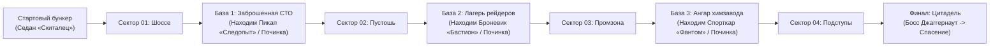

# Rogue Drive Survival - контекст геймдизайна

Этот файл является журналом согласованных решений по концепции игры. Его нужно обновлять после каждого уточнения концепта.

28.09.2026: уточнено устройство безопасной СТО: катсцена открывает ангар и ставит машину в бокс; верстак показывает живую машину слева и действия с деталями справа; приёмка продаёт добычу. Казино остаётся отдельной рискованной придорожной локацией — пользователь исправил оговорку о его размещении в ангаре. Реализация: `JOURNEY_STATIONS.md`.

28.09.2026: в четырёх сценах кампании подключён цикл трёх промежуточных СТО «Северная», «Каньон», «Рубеж»: боковые ангары, торговля и обслуживание одной машины, фильтрационное ожидание, аварийная помощь, снимки прибытия и подготовленного выезда, новая волна после выезда. Четвёртый регион заканчивается Цитаделью. Реализация и границы проверки: `JOURNEY_STATIONS.md`. Численные параметры предварительные; отдельная сетевая сцена этим изменением не переносится на новый цикл.

28.09.2026: пользователь подтвердил начало выполнения плана первой версии для Steam. Целевой первый срез — Windows, два игрока, одна общая машина и законченная экспедиция от бункера до безопасной СТО. Состав, критерии приёмки и подготовка магазина: `STEAM_RELEASE_PLAN.md`. Сначала демоверсия; решение о платном Early Access — после внешней проверки содержимого. Интернет через Steam входит в целевой выпуск, текущий LAN/VPN остаётся промежуточным этапом. Это принятый план, не статус готовности.

25.09.2026: пользователь подтвердил исправность управления и проезда маршрута. По его разрешению выполнен первый проход наполнения остановок, ориентиров, звука и признаков приближения бури. В `Stage1_Outskirts` семь обозначенных точек, конечная СТО остаётся боковой остановкой. Добыча физическая и конечная; пригородный ремонтный бокс не защищает от бури. Предварительная фиксированная скорость фронта — 13,5 м/с при начальном отрыве 900 м. Реализация, расчёт темпа и границы проверки: `JOURNEY_CONTENT.md`.

## Утверждённый кооператив — 2026-09-25

Пользователь утвердил направление: сначала довести игру вдвоём. Эти правила имеют приоритет над историческими планами кооператива ниже. Подробности и этапы: `COOP_DESIGN.md`. Это согласованный дизайн, не отчёт о реализации.

25.09.2026: реализован и проверен первый технический этап в отдельной сцене `Coop_Outskirts`: два участника по LAN/VPN, общая машина, самостоятельные камеры, посадка и смена водителя после остановки. Windows-сборка и тест двух процессов описаны в `Artifacts/Coop/REPORT.md`. Общий лут, враги, ремонт, поднятие, ловушки и масштабирование встреч в кооп ещё не перенесены.

- Два игрока, один общий автомобиль; режим на 3–4 игроков отложен до проверки полноценного коопа на двоих.
- В движении водитель управляет машиной, маневрирует и таранит; штурман/оператор защиты выбирает маршрут и парковку, наблюдает за погоней свободной камерой и использует ограниченные сбрасываемые ловушки. Ловушки получают повышенный приоритет для кооперативного прототипа. Турели и стрельба из пассажирских мест в первую версию не входят.
- Обязанности свободные: оба умеют водить, ремонтировать, переносить добычу и защищаться пешком. На остановке можно поменяться местами; водительское место занимает только один игрок.
- Полевой ремонт требует остановки. На вылазках команда сама делит ремонт, поиск, переноску и прикрытие; постоянный охранник у автомобиля не обязателен.
- Сложность дороги и локаций масштабируется отдельно через бюджет состава и размещения угроз. Стартовые тестовые множители для двоих: дорога ×1,15, охрана локаций ×1,50; для одного ×1,00. Это гипотезы баланса, не проверенные итоговые значения.
- Число игроков не увеличивает здоровье и урон обычных врагов, скорость бури, расход топлива или повреждения машины отдельным множителем. Физические эффекты массы сохраняются по общим правилам.
- Автомобиль, детали, деньги и багажник общие. Запас аптечек и боеприпасов умеренно увеличивается; коэффициенты определяются тестами. Хорошая координация должна давать реальную выгоду.
- Состав встречи фиксируется до её начала; изменение группы учитывается для следующих встреч, падение товарища не облегчает текущий бой. Первое подключение новых участников — в бункере или на безопасной СТО.
- Предусмотреть поднятие раненого, восстановление команды на безопасной СТО и общее поражение при потере всего экипажа или машины. Стоимость и время поднятия, переподключение и технические правила сессии ещё требуют проработки.
- Первый сценарий приёмки: совместная поездка → выбор остановки → добыча крупной детали под угрозой → устранение утечки → уход от погони. Основной критерий: пассажир принимает собственные полезные решения, а смена ролей интересна обоим.

25.09.2026: по команде «Стартуй» реализован первый прототип врагов — три обычных зомби у первой АЗС в `Stage1_Outskirts`, обнаружение пешего персонажа и машины, обход препятствий, удар с замахом, потеря цели и раздельный урон. Здоровье персонажа теперь допускает поражение; голод и жажда не расходуются со временем. Подробности, проверки и дальнейшие предложения — `ENEMY_SYSTEM.md`.

25.09.2026: следующий этап добавил пешую самооборону в одиночном режиме: стартовая физическая монтировка в быстром слоте, ЛКМ — удар на 20 урона (три попадания по обычному зомби), V — толчок без урона с прерыванием атаки и паузой 2 с. Удары учитывают стены, дальность и смену слота во время замаха. Пройдены 22 проверки ближнего боя в Play Mode; сетевая синхронизация этих действий пока не реализована.

Текущий прототип мастерской и проверенные ограничения реализации описаны в `WORKSHOP_SYSTEM.md`. Локации сервиса пока не строились; проектные правила ниже остаются целевым концептом.

25.09.2026: начат проезжаемый прототип первого маршрута на 15–20 минут с вылазками. В `Stage1_Outskirts` сохранены 13,29 км дороги, шесть черновых придорожных площадок и перенесённый финиш у безопасной сервисной зоны. Это первый проход геометрии и баланса, не окончательная реализация локаций и торговли. Расчётный обычный темп — 17,3 минуты; полного ручного замера пока нет. Подробности: `STAGE1_ROUTE.md`.

## Актуальные решения по геймплею — 2026-09-24

### Утверждённое дополнение первой сцены — подготовка выезда

- После сборки машины цель первого этапа показывается катсценой: путь от Бункера 07 к ближайшей безопасной СТО и угроза догоняющей бури.
- Игрок обучается багажнику действием: загружает запас бензина и ремкомплект. Дополнительные припасы выбирает самостоятельно.
- Гараж получает разметку рабочих зон, следы ремонта, инженерные детали, личные вещи и световые акценты на полезных объектах.
- Перед выездом сохраняется подготовленная машина с грузом. После поражения можно повторить поездку или изменить подготовку без повторного пробуждения и сборки. Неудачная попытка не даёт накопить добычу поверх контрольной точки.
- Реализация и границы первого этапа описаны в `GARAGE_DEPARTURE.md`.

Этот раздел фиксирует согласованные с пользователем правила и имеет приоритет над более ранними записями ниже. Это требования к игре, а не отчёт об их реализации. Исторические записи сохранены для контекста. После каждого завершённого блока обсуждения обновлять этот файл; предложения без подтверждения оставлять открытыми вопросами.

### Основной цикл и маршрут

**Поездка → придорожная локация → добыча → риск → безопасная АЗС/СТО → подготовка → следующая поездка.**

- Жанр остаётся Survival Racing. Игрок соревнуется со временем: сзади приближается буря. Цель этапа — добраться до следующей безопасной АЗС/СТО.
- Центральный выбор: стоит ли найденная добыча потраченного времени, ресурсов и состояния автомобиля. Вождение и выживание на дороге остаются основой; пешие вылазки короткие и обслуживают автомобильный цикл.
- Между СТО пробуем развилки с разными рисками и выгодами: короткий опасный путь, длинный объезд, путь через богатую локацию. Конкретную геометрию проверяем прототипом.
- Целевая длительность этапа для первого прототипа — **15–20 минут вместе с вылазками**. Времени хватает на несколько остановок, но не на спокойный сбор всего лута.
- Фронт бури отображается на карте; предупреждения помогают оценить запас времени. На локациях буря продолжает двигаться.
- Скорость бури фиксирована для каждого этапа и не подстраивается под скорость игрока. Хорошее вождение позволяет заработать дополнительное время на добычу.
- Попадание в бурю не означает мгновенное поражение: ухудшается видимость, постепенно убывает здоровье персонажа. Пешком урон выше; салон автомобиля обеспечивает защиту и даёт больше времени выбраться. Бесконечно пережидать бурю в машине нельзя. Численные параметры и возможное воздействие на узлы автомобиля ещё не определены.
- Безопасная АЗС/СТО позволяет спокойно торговать и обслуживать машину. Следующий этап начинается после выезда. Заброшенная АЗС как локация добычи не равнозначна безопасной базе.
- Безопасность СТО объясняется укреплённым ангаром с фильтрацией. Герой пережидает прохождение фронта; после этого открывается следующий участок пути до новой волны бури. Это объясняет спокойное обслуживание и новый отсчёт опасности. Способ показа ожидания и перехода пока не определён.

### Угрозы, вождение и одна машина

- У игрока **одна машина на протяжении игры**, которую он постепенно перестраивает. Смена классов автомобиля на промежуточных базах отменена.
- Управление доступное, аркадное, с ощутимым весом: торможение, заносы, дорожное покрытие и масса груза влияют на езду. Степень влияния требует настройки в прототипе.
- Угрозы: зомби, вооружённые люди на локациях, вражеские автомобили на дороге, нехватка топлива и автомобильных жидкостей.
- В дорожных столкновениях начинаем с манёвров и тарана; позже добавляем ограниченный запас сбрасываемых ловушек. Полноценная стрельба из автомобиля не входит в согласованную начальную боевую основу; старые планы турелей требуют пересмотра.
- От автомобильных противников можно оторваться без уничтожения: увеличить дистанцию, свернуть или вынудить преследователя врезаться. Успех погони — возможность продолжить путь; уничтожение врагов не обязательно.
- Враги могут повредить припаркованный автомобиль, если обнаружили его или преследовали игрока. Они не появляются у машины специально из-за отсутствия хозяина. Выбор парковки влияет на безопасность вылазки.
- Пешком доступна ограниченная самооборона: оружие помогает вырваться, но зачистка стоит времени и боеприпасов. Полная зачистка не является обязательной целью вылазки.
- Выживание персонажа строится на здоровье и аптечках. Голод, жажда и сон не вводятся; основной ресурсный менеджмент связан с автомобилем.
- Улучшения имеют компромиссы. Примеры направления баланса: броня увеличивает защиту и массу; мощный двигатель увеличивает расход топлива; дополнительный бак конкурирует за место. Точные характеристики ещё не утверждены.

### Лут, переноска и багажник

- Игрок выходит из машины и совершает короткие вылазки по небольшим придорожным локациям, затем возвращается с добычей к автомобилю.
- Находит внешние и внутренние автомобильные детали, расходники, ремонтные материалы и ценные предметы на продажу. Точный каталог предметов пока открыт.
- Локации имеют понятную специализацию: гаражи — детали и ремонтные ресурсы; заправки — автомобильные жидкости; магазины — ценности и аптечки; конвои — смешанная добыча под усиленной охраной. Тип места помогает планировать поиск, но конкретная находка заранее неизвестна.
- Внешние детали меняют оснащение машины; внутренние — её рабочие характеристики. Найденную деталь нужно довезти до подходящей мастерской и оплатить установку: полное обслуживание доступно на безопасной СТО, ограниченное — на оборудованной придорожной заправке.
- Найденные детали бывают исправными и повреждёнными. Состояние и характеристики видны до подбора; повреждённая деталь требует ремонта перед установкой.
- Все автомобильные детали совместимы с машиной в пределах соответствующего места установки; поиск переходников не требуется. Выбор определяется характеристиками, состоянием и занимаемым местом.
- Снятая деталь возвращается игроку: её можно продать или увезти как запасную при наличии места в багажнике.
- **Одна крупная деталь в руках**, видимая точка укладки в багажник, возможность мгновенно бросить груз. Ручное вращение предмета для укладки не требуется.
- С крупной деталью в руках стрелять нельзя: сначала нужно бросить или уложить её.
- Багажник ограничен грузовыми местами. Мелкие предметы складываются в стопки, крупные детали занимают несколько мест. Дополнительный багажник увеличивает вместимость. Число мест и размеры стопок ещё не определены.

### Экономика и обслуживание

- **Весь найденный лут можно продать на СТО за монеты.** Монетами оплачиваются установка найденных деталей, ремонт, покупка деталей и расходников. Прямой бартер не является основной системой оплаты СТО.
- Подходящую найденную деталь игрок оставляет себе и **платит только за работу по установке**; продавать её и выкупать обратно не требуется. Ремонт повреждённой детали оплачивается отдельно. Покупка детали из ассортимента мастерской — альтернативный способ получить улучшение.
- Основа заработка — найденная и успешно довезённая добыча. Выбор расходов: установить улучшение сейчас или обеспечить ремонт и запас ресурсов для следующего этапа.
- Топливо расходуется постоянно при эксплуатации машины. Масло и охлаждающая жидкость теряются главным образом при повреждениях; постоянное доливание всех жидкостей не является целью механики.
- В дороге можно заправляться, доливать жидкости, менять колесо и временно устранять утечки ремкомплектом. Полевое обслуживание требует остановки и времени.
- Полный ремонт, замена двигателя и переборка его внутренних узлов выполняются на безопасной СТО. Часть улучшений можно установить на придорожной заправке с ремонтным боксом; доступность работы зависит от её оборудования.
- СТО продаёт базовые детали и небольшой меняющийся ассортимент улучшений. Наиболее интересные варианты находятся в опасных локациях. Порядок обновления ассортимента ещё нужно определить.
- В первой версии нет разборки добычи на материалы: ненужные детали продаются, ремонтные материалы находятся или покупаются.
- При нехватке денег на минимальный ремонт и топливо доступна бесплатная аварийная помощь на СТО: минимальная работоспособность машины и топливо до ближайшей точки снабжения. Полный ремонт, запас ресурсов и улучшения остаются платными. Точные пороги помощи требуют балансировки.

### Три безопасные СТО на пути к Цитадели

**Бункер 07 → Окраина → СТО №1 → Пустошь → СТО №2 → Промзона → СТО №3 → Цитадель.**

- До Цитадели предусмотрены **три промежуточные безопасные СТО**. Все позволяют продавать добычу, ремонтировать машину и за монеты устанавливать привезённые детали; ассортимент и оборудование различаются.
- СТО №1 после Окраины — базовые детали, ремонт и первая подготовка к дальней дороге.
- СТО №2 после Пустоши — более мощные двигатели, внедорожная подвеска и броня.
- СТО №3 после Промзоны — продвинутые детали и окончательная подготовка перед Цитаделью. Точные уровни и состав ассортимента требуют балансировки.
- Разделы мастерской: **«Двигатель»** (типы двигателей, турбины, поршни, радиатор и другие узлы), **«Подвеска»** (пружины, амортизаторы и колёса), **«Кузов»** (внешние элементы). Конкретный каталог и характеристики уровней пока открыты.
- Безопасные СТО сохраняют роль мест спокойной подготовки и контрольных точек. Придорожные заправки не заменяют их.

### Рискованное обслуживание на придорожных заправках

- Между безопасными базами игрок может необязательно остановиться на заправке ради обслуживания или улучшения машины. **Буря продолжает двигаться**, возможны враги; открытие инвентаря, торговли или сервисного меню не останавливает время.
- Обычная заправка позволяет заправиться, долить масло и охлаждающую жидкость, заменить аккумулятор или колесо.
- Некоторые заправки имеют **ремонтный бокс**: там можно за монеты установить привезённую деталь или приобрести небольшое улучшение, если оборудование позволяет выполнить работу. Замена двигателя и переборка поршней остаются работами полноценной безопасной СТО.
- Торговля доступна только при наличии торговца, с небольшим ассортиментом. Полноценная продажа всей добычи и основной выбор деталей сосредоточены на безопасных СТО.
- До начала работы интерфейс показывает **стоимость и длительность**, а во время обслуживания — приближение бури и оставшееся расстояние до её фронта. Точные цены и время работ определяются при балансировке.
- До начала работы можно отказаться. После снятия узла для выезда нужно завершить установку либо вернуть старую деталь: разобранная машина не становится исправной при закрытии меню.
- На карте обычная заправка и заправка с ремонтным боксом имеют разные обозначения, чтобы игрок заранее понимал доступные услуги.
- Для первого прототипа — **одна рискованная сервисная остановка между безопасными базами**. Посещение необязательно: игрок выбирает между немедленным улучшением и сохранением отрыва от бури.

### Поражение и контрольная точка

- Сохраняются два состояния: **прибытие на СТО до покупок** и **подготовленный выезд**. После поражения «Повторить» восстанавливает готовую машину на выезде, а «Изменить подготовку» возвращает состояние прибытия, позволяя иначе потратить те же деньги без штрафа за неудачный выбор.
- Добыча неудачной поездки теряется; потраченные в ней припасы восстанавливаются до сохранённого состояния. Автомобиль и груз восстанавливаются из той же контрольной точки.
- Награды и ресурсы неудачной попытки не накапливаются поверх сохранения.
- При повторе этапа расположение добычи и врагов сохраняется, чтобы игрок мог учесть ошибку и выбрать другой маршрут.
- При выборе «Изменить подготовку» покупки, продажи и работы предыдущей подготовки откатываются вместе с деньгами и предметами к состоянию прибытия. Можно заново выбрать груз и установленные детали. Добыча неудачной поездки не сохраняется, предметы и деньги не дублируются.

### Казино — слот-машина и согласованные правила

- Пользователь напомнил о существующей системе казино; её необходимо учитывать в дальнейшем проектировании. Реализация в этой сессии не проверялась.
- Казино — необязательная отдельная придорожная локация со слот-машиной: игрок вращает слот и может выиграть приз. Буря продолжает приближаться; казино не является безопасным СТО или контрольной точкой. Это заменяет прежнее описание безопасного оазиса.
- Для ставок используются найденные жетоны, которые нельзя покупать за обычные деньги.
- Призы: припасы, ценности на продажу и редкие автомобильные детали. Детали сохраняют компромиссы, требуют места для перевозки и платной установки в подходящей мастерской по общим правилам обслуживания.
- Жетон можно вместо ставки продать на СТО за небольшую фиксированную сумму; точная цена ещё не определена.
- Сирена и привлечение мутантов были указаны в старом описании. Пользователь запросил пояснение этого предложения; оно не подтверждено для актуального цикла. Нужно уточнить, возможен ли пустой результат или каждое вращение выдаёт приз. Сирену не считать актуальным согласованным требованием.
- Повторяемость результатов слота после поражения/загрузки остаётся открытой: на предложение сохранять последовательность результатов ответа пока нет.

### Открытые вопросы текущего обсуждения

- Уточнение прежней сюжетной цели и финала применительно к обновлённому циклу; число этапов внутри секторов. Три промежуточные безопасные СТО до Цитадели согласованы.
- Набор оборудования придорожных ремонтных боксов, перечень доступных работ, их цены и длительность; для прототипа согласована одна необязательная рискованная сервисная остановка между безопасными базами.
- Планировка локаций, конкретный каталог лута, цены, частота находок и обновление ассортимента СТО; специализация локаций и совместимость деталей по месту установки уже согласованы.
- Параметры здоровья и лечения, длительность применения аптечки; голод, жажда и сон исключены.
- Казино: пустой результат или гарантированный приз, судьба старой идеи сирены, повторяемость результатов после загрузки, стоимость ставки и вероятности наград. Расположение вне безопасного СТО, жетоны, продажа жетонов и категории призов согласованы.
- Численные параметры фиксированной скорости бури и урона, предупреждения, переход между волнами; фильтруемый ангар как объяснение безопасности СТО уже согласован.
- Прежние планы: смена машин отменена; кооператив заменён утверждёнными правилами от 2026-09-25 выше и в `COOP_DESIGN.md`; турели не входят в первую кооперативную версию.


## Ранее зафиксированные решения (с учётом приоритета раздела 2026-09-24)

> Историческая таблица: правила смены машин, турелей и отсутствия влияния массы груза ниже заменены актуальными решениями от 2026-09-24. Остальные прежние решения сохраняются, если не противоречат актуальному разделу.

| Область | Решение |
| --- | --- |
| Рабочее название | Rogue Drive: Survival |
| Жанр | Survival Racing / Post-Apocalyptic Road Odyssey (гибрид *A Long Drive* + *Earn to Die* + элементы *Pacific Drive*) |
| Платформы | ПК (Windows: Клавиатура + Мышь), цифровая дистрибуция через Steam и VK Play |
| Движок и версия | Unity 6 LTS (6000.0.57f1), C# |
| Целевая аудитория и рейтинг | 12+ (PG-13): аркадный экшен, стилизованные взрывы, искры, отлетающие запчасти без излишней крови и расчленёнки |
| Визуальный стиль | Стилизованный Low-Poly / Mid-Poly: чистая читаемая картинка, стабильные 144 FPS на ПК, высокая доступность ассетов из Unity Asset Store |
| Камера и ракурс | При вождении: динамическая камера от 3-го лица сзади-сверху (Cinemachine) со смещением в сторону прицела (Look-Ahead). При выходе из авто на [E]: бесшовный переход в вид от 1-го лица (FPS) для пешего лутинга и ремонта |
| Геометрия трассы и мир | Длинное постапокалиптическое шоссе с придорожными точками интереса (POI): заброшенные АЗС, мотели, гаражи, СТО, блокпосты, разбитые конвои. Дорога имеет развилки и опасные препятствия |
| Языки первого релиза | Русский и английский |
| Модель монетизации | Премиум (Buy-to-Play / B2P): разовая покупка в Steam (базовая цена 380–450 руб. / $8.99–$9.99) + опциональный Supporter Pack DLC (199 руб. / $2.99) с саундтреком и скинами |
| Разработка | Один разработчик, учебный дипломный проект |
| Главный герой и сюжет | Алексей «Связист» — бортовой инженер Бункера 07. Везет в Цитадель крио-капсулу со стабилизатором атмосферных фильтров («Протокол Закат»). Цель — прорваться через 4 сектора к шлюзу «Врата-01» до детонации запечатывающих зарядов |
| Мир и атмосфера 4 секторов | Фиксированная визуальная атмосфера каждого сектора: Сектор 1 — золотистый закат на пригородном шоссе; Сектор 2 — пыльная палящая дневная пустошь; Сектор 3 — ночная ядовитая промзона (свет фар, кислота); Сектор 4 — грозовой токсичный шторм Цитадели |
| Основной режим | Экспедиция выживания на автомобиле из точки А в точку Б через 4 сектора с промежуточными укрепленными базами |
| Дополнительный режим | Бесконечная дорога (Endless Survival Drive) на выживание и дистанцию |
| Управление автомобилем и героем | За рулем (3-е лицо): физическое руление (WASD), ручной тормоз (Пробел), глушение мотора/фар ([I]/[L]), посадка/высадка ([E]), стрельба из турели мышью. Пешком (1-е лицо): ходьба (WASD), осмотр мышью, оружие самообороны в руках (пистолет/монтировка [ЛКМ]), взаимодействие/подбор предметов ([E]) |
| Механика нитро и физика массы | **Нитро полностью убрано из игры**. Аркадная физика без влияния веса багажа: масса переносимого и уложенного в кузов лута не ухудшает управляемость, сохраняя комфортный драйв |
| Модель повреждений и HUD авто | **Общая полоска HP машины полностью удалена**. Экранный тактический HUD отображает аналоговые шкалы (спидометр, остаток бензина, температура охлаждайки) и силуэт автомобиля с состоянием 4 шин, радиатора, бака и навесной брони |
| Условия гибели, сохранения и чекпоинты | Сохранение прогресса на укрепленных базах СТО. При гибели персонажа или накрытии штормом заезд продолжается с последней посещенной базы с сохраненным состоянием авто и лута. При поломке на трассе есть шанс добежать пешком |
| Багажник и инвентарь (A Long Drive) | Контекстная панель багажника: подход к корме на [E] открывает удобную сетку слотов багажника (канистры с бензином/водой, запасные шины, ящики с ломом, патроны) без физических багов выпадения предметов |
| Полевое обслуживание на обочине | Контекстные панели внутренних систем на [E]: у капота — панель ДВС и радиатора (температура, охлаждайка, АКБ); у лючка бака — панель заправки топливом |
| Интерактивные 3D-мастерские (Earn to Die) | Глубокий тюнинг и установка тяжелых узлов на базах СТО от 1-го лица: внутренности через панели, а всё навесное оборудование монтируется физически на 3D-сокеты |
| 5 ключевых модульных систем авто | 1) Силовой агрегат (моторы, радиаторы — панель ДВС); 2) Подвеска и шины (физический монтаж на ступицы); 3) Таран и броня (физический монтаж кенгурятников и бронелистов); 4) Оружие на сокеты (физический монтаж турелей на крышу/борта); 5) Утилиты (физический монтаж багажника на крышу, доп. фар) |
| Фактор гонки (Survival Racing) | **Надвигающийся токсичный пылевой шторм (Creeping Dust Storm)**: буря медленно ползет сзади по трассе, отрезая путь назад и заставляя вовремя покидать зоны лутинга и жать на газ |
| Боевая система и дорожные стычки | На шоссе: динамические перестрелки и стычки с багги рейдеров (пытаются взять в клещи и пробить колеса), огонь турели (Mouse-Aim), сброс шипов ([Q]), таран кенгурятником. Пешком: пистолет и монтировка |
| Финальный босс (блокиратор 4 сектора) | Тяжелый джаггернаут-перехватчик рейдеров: скоростная дуэль-погоня на подступах к шлюзу Цитадели перед закрытием ворот |
| Система сокетов (слотов) | Физические точки монтажа 3D-моделей навесного оборудования на кузове машины (колеса, кенгурятник, багажник на крышу, турели, бронелисты). Составляет ключевую научную новизну диплома |
| Архетипы автомобилей и смена техники | 4–5 глубоких архетипов: Седан «Скиталец» (стартовый баланс), Пикап «Следопыт» (грузовой кузов, пулемет ДШК), Броневик «Бастион» (тяжелый таран, броня), Спорткар «Фантом» (скоростной перехватчик) + бонусный Багги рейдеров |
| Экономика и ресурсы | Физические ресурсы: Топливо (л), Вода/Охлаждайка (л), Металлолом/Запчасти (шт), Патроны, Ремкомплекты, Золотые жетоны казино (Chips) |
| Придорожное Казино «Фортуна Пустоши» | Уникальная неоновая POI в Секторе 02: слот-машина за золотые жетоны (Джекпот — редкие легендарные модули сокетов, победа — ценный лут, «зеро» — сирена и орда мутантов) |
| Кооперативный режим (Co-op Crew) | Совместный заезд на 2 игроков в одном экипаже: Игрок 1 — Водитель (рулит, дрифтует, таранит кенгурятником, следит за дорогой); Игрок 2 — Стрелок/Механик (крутит турель 360°, сбрасывает мины, на пит-стопе бежит лутать АЗС и чинить машину) |
| Стартовая сборка в Бункере 07 | Обучающий интерактив: колесо прикручиваем физически на ступицу [E], капот и багажник обслуживаем через быстрые панели ДВС и инвентаря [E] |
| Дорожное радио «Голос Пустоши» | Переключение волн на [R]: 1) Ретровейв/рок; 2) Сводки диспетчера «Маяк» о шторме; 3) Перехват радиопереговоров рейдеров с предупреждением о засадах |
| Случайные дорожные события (Events) | Динамические ситуации на шоссе: засады багги рейдеров с горящими бочками, брошенные бензовозы (джекпот топлива с риском взрыва), кислотные тучи |
| Визуал тарана: Следы крови на кузове | Отказ от сложной деформации меша/грязи. При сбивании зомби на скорости на бампере, решетке кенгурятника и капоте остаются брызги и потеки крови |

## Подтверждённые гипотезы (перенесены в зафиксированные решения)

* [x] **Длительность этапа (обновлено 2026-09-24):** 15–20 минут между СТО вместе с вылазками — цель первого прототипа; заменяет прежние 3–4 минуты.
* [x] **Типы угроз:** подтверждено сочетание контактных врагов (обычный, бегун, громила) и дистанционных (кислотный плевака).
* [x] **Роль сокетов:** подтверждена как ключевая научная новизна проекта (модификатор не только меняет формулы, но и физически инстанцирует 3D-пушку в свободный сокет кузова).
* [x] **Геометрия трассы:** отказ от прямолинейного рельсового движения — трасса извилистая, с развилками и тактическим выбором траекторий.

## Архив закрытия прежних вопросов

> [!NOTE]
> Историческая сводка. Пункты о смене машин, ресурсах и наградах ниже не являются актуальными требованиями. Текущие решения и открытые вопросы приведены в разделе от 2026-09-24.
> Ниже приведена сводка их закрытия:

1. **Целевая аудитория и возрастной рейтинг:** Решено $\rightarrow$ 12+ (PG-13), аркадный визуальный тон без расчленёнки.
2. **Визуальный стиль и настроение мира:** Решено $\rightarrow$ Стилизованный Low-Poly / Mid-Poly постапокалипсис.
3. **Главная цель кампании и сюжет:** Решено $\rightarrow$ Эвакуация из Безопасного Города в конце 4-го сектора.
4. **Структура карты кампании:** Решено $\rightarrow$ 4 региона на глобальной карте, линейное открытие с возможностью повторных заездов для фарма.
5. **Правило открытия и покупки авто:** Решено $\rightarrow$ Открытие машины по завершении соответствующей локации, покупка за монеты в гараже.
6. **Полный список ресурсов и их получение:** Решено $\rightarrow$ Монеты (дистанция/киллы/бонусы/ящики), Опыт (сферы за киллы), Топливо и HP (живучесть авто), Нитро (накапливаемая шкала).
7. **Роль и механика финального блокиратора 4 локации:** Решено $\rightarrow$ Бронированный блокпост / Тяжёлый джаггернаут-перехватчик с полосой здоровья и волнами миньонов.
8. **Награда за первое прохождение локации:** Решено $\rightarrow$ Разовый крупный бонус монет (~2 средних заезда).
9. **Модель монетизации и ценообразование:** Решено $\rightarrow$ Премиум (Buy-to-Play) в Steam (380–450 руб. / $8.99–$9.99) + опциональный Supporter Pack DLC (199 руб. / $2.99). Полный отказ от мобильной рекламы и доната.
10. **Список автомобилей, врагов, боссов и модификаторов:** Решено $\rightarrow$ 4 авто (Седан, Фургон, Внедорожник, Броневик), 4 врага (Зомби, Бегун, Громила, Кислотный плевака), 1 финальный босс, 12 модификаторов сокетов/эффектов.

## Журнал изменений

**2026-09-24, правила слота:** Подтверждены отдельная необязательная локация казино под давлением бури без контрольной точки, ставки найденными непокупаемыми жетонами, припасы/ценности/редкие детали как призы и возможность продажи жетона на СТО. Пользователь уточнил формат слот-машины; предложение о сирене требует пояснения, повторяемость результатов после загрузки не подтверждена.

**2026-09-24, детали и подготовка:** Согласованы повреждённые находки с заранее видимыми характеристиками, совместимость по месту установки без переходников, возврат снятых деталей, базовые детали и ограниченный меняющийся ассортимент улучшений на СТО, отсутствие разборки в первой версии. Утверждены сохранения прибытия и выезда с полным откатом подготовки по выбору игрока. Пользователь напомнил о казино; правила его интеграции вынесены на обсуждение.

**2026-09-24, буря и преследование:** Подтверждены фиксированная скорость бури на этапе, повышенный урон персонажу пешком и защита салона без бессрочного укрытия; безопасный ангар СТО с фильтрацией и переход к следующей волне; возможность нападения на обнаруженную припаркованную машину без искусственного появления врагов; возможность отрыва от преследователей без их уничтожения. Вопрос о прежней сюжетной цели не получил ответа и остаётся открытым.

**2026-09-24, следующий блок уточнений:** Подтверждены здоровье и аптечки без голода/жажды/сна; неизменное расположение добычи и врагов при повторе; возможность пересмотреть подготовку на СТО после поражения; специализация локаций; бесплатная минимальная аварийная помощь. Подтверждение прежней сюжетной цели остаётся открытым.

**2026-09-24:** Зафиксированы завершённые вопросы обсуждения: цикл Survival Racing, буря и развилки, 15–20 минут между СТО, одна машина, компромиссы улучшений, переноска и багажник, продажа ценностей за деньги, полевой ремонт, ограниченная самооборона и откат к состоянию на выезде с СТО. Бесплатная помощь на СТО ещё не согласована. Более ранние записи ниже сохраняют историю, включая отменённые решения.

| Дата | Решение |
| --- | --- |
| 2026-09-22 | **(Дорожное радио, Случайные события и Следы крови на кузове)**<br>1) **Визуал тарана (Кровь вместо грязи и вмятин):** Полный отказ от сложной процедурной деформации меша, грязи и физических вмятин. Вместо этого при сбивании зомби на бампере, решетке кенгурятника и капоте появляются сочные брызги и потеки крови (*Carmageddon / Earn to Die*).<br>2) **Радио на [R]:** 3 канала (музыка ретровейв/рок, сводки диспетчера «Маяк» о буре, перехват переговоров рейдеров с предупреждением о засадах).<br>3) **Дорожные события:** Случайные засады рейдеров с горящими бочками, брошенные цистерны с бензином (джекпот топлива с риском взрыва), кислотные аномалии. |
| 2026-09-22 | **(Расширение концепции: 4–5 Архетипов, Казино «Фортуна Пустоши» и Кооператив Экипажа)**<br>1) **Автопарк:** Зафиксировано 4–5 глубоких архетипов (Седан «Скиталец», Пикап «Следопыт», Броневик «Бастион», Спорткар «Фантом» + бонусный Багги) с уникальной физикой, вместимостью и сокетами под тяжелое вооружение.<br>2) **Придорожное Казино:** Интеграция существующей системы казино как атмосферной неоновой POI в Секторе 02 со слот-машиной за золотые жетоны (Джекпот — легендарные сокетные модули, провал — пожарная сирена и орда мутантов).<br>3) **Кооператив «Экипаж» (2 игрока):** Совместное управление одной машиной: Игрок 1 — Водитель (3-е лицо, руление, таран, приборы), Игрок 2 — Стрелок/Механик (360° огонь турели мышью, ракеты, мины; пеший лутинг АЗС и починка на пит-стопе). |
| 2026-09-22 | **(Гибридная система обслуживания: Панели + Физический 3D-монтаж)**<br>Утверждена элегантная архитектура: внутренние агрегаты и жидкости (капот $\rightarrow$ панель ДВС и радиатора, багажник $\rightarrow$ панель слотов груза, лючок $\rightarrow$ панель бака) обслуживаются через быстрые контекстные UGUI-панели на [E] без необходимости сложного 3D-моделирования анимаций открытия. Всё внешнее навесное оборудование (колеса на ступицы, кенгурятники на бампер, багажники на крышу, турели, бронелисты) монтируется физически на 3D-сокеты прямо в сцене от 1-го лица, сохраняя научную новизну диплома. |
| 2026-09-22 | **(Стартовая сборка в бункере и интерактивный туториал)**<br>В стартовом Бункере 07 введена механика базовой физической сборки Седана «Скиталец» от 1-го лица перед выездом: установка недостающего колеса со стеллажа на пустую ступицу [E], монтаж силового аккумулятора в гнездо под капотом [E], заливка первой канистры топлива в бак [E] и укладка снаряжения в багажник. Обучает игрока правилам работы сокетов, жидкостей и инвентаря перед выездом на опасное шоссе. |
| 2026-09-22 | **(Смена концепции: A Long Drive + Earn to Die + Survival Racing)**<br>1) **Отказ от мобильных условностей:** Полностью убраны нитро, сбор сфер опыта из зомби и абстрактная полоска HP автомобиля.<br>2) **Исследование и лутинг (A Long Drive):** Остановка у придорожных POI, глушение двигателя и тушение фар (шум и свет привлекают мутантов), выход от 1-го лица (`[E]`), зачистка зданий пистолетом/монтировкой. Ручной перенос тяжелых объектов в руках (канистры с бензином/водой, колеса, пулеметы) и фиксация в зоне багажника на `[E]` (без выпадения на кочках). Мелочи — в карманы.<br>3) **Модульное состояние автомобиля (Pacific Drive):** Экранный тактический HUD при вождении от 3-го лица отображает аналоговые приборы (спидометр, бензин, температура радиатора) и силуэт авто со статусом 4 шин, радиатора, бака и бронелистов. Экспресс-уход в поле: заливка бензина, доливка воды в радиатор под капотом (защита от перегрева), замена пробитых колес запаской. Масса багажа не ухудшает физику, сохраняя аркадный комфортный драйв.<br>4) **5 модульных систем улучшения (Earn to Die):** 1) Двигатель и радиатор; 2) Подвеска и шины; 3) Кенгурятники и броня; 4) Вооружение сокетов; 5) Утилиты (багажники, доп. канистры, фары). Установка тяжелых деталей производится на базах СТО от 1-го лица в 3D-мастерской.<br>5) **Атмосфера 4 секторов и сохранения:** Четкий колорит регионов: 1 — закатное шоссе; 2 — дневная песчаная пустошь; 3 — ночная токсичная промзона (свет фар); 4 — штормовой финал. Сохранение прогресса происходит на базах СТО; при гибели от шторма или мутантов заезд перезапускается с последней базы.<br>6) **Гибридный автопарк:** На базах игрок находит и чинит новые классы техники (Пикап, Броневик, Спорткар), но сам решает — продолжить путь на полюбившемся Седане или перенести модули на новый транспорт.<br>7) **Фактор гонки и дорожный бой (Survival Racing):** Надвигающийся токсичный пылевой шторм (Creeping Dust Storm) преследует игрока. На шоссе — динамические стычки с багги рейдеров (клещи, таран, стрельба) и ордами зомби. При поломке авто сохраняется шанс спастись пешком до ближайшей брошенной машины или базы. |
| 2026-09-22 | **(Переход на ПК-геймплей: Управление, Топливо, Бой, Камера и Пит-стопы)**<br>1) **Mouse-Aim & Dual Control:** Свободное ручное наведение башни турели мышью по тактическому 3D-прицелу на асфальте с радиальной индикацией перезарядки способностей; огонь на `[ЛКМ]`, вторичное оружие (залп ракет) на `[ПКМ]`. Платформа — ПК (Windows: Клавиатура + Мышь), Steam Deck отложен на пост-релиз.<br>2) **Динамическая камера (Look-Ahead):** Камера смещается в сторону курсора мыши для лучшего обзора зоны обстрела; динамическое отдаление и расширение FOV на скорости/нитро.<br>3) **Реформа топлива (Limp Mode):** Отказ от смерти при нулевом баке; машина переходит в аварийный режим со снижением скорости до ~45 км/ч и отключением нитро. Дозаправка бака происходит исключительно на безопасных пит-стопах.<br>4) **Интерактивные 3D-пит-стопы:** Отказ от пауз посреди скоростной гонки; при заезде в бокс СТО камера берет крупный план авто, игрок распределяет модули по физическим 3D-сокетам кузова.<br>5) **Vehicular Combat:** Боковой силовой таран на клавишу `[F] / [E]` (Side Ram), сброс шипов и мин `[Q]`, активные перестрелки с машинами рейдеров.<br>6) **Динамический босс-файт:** Финальная битва с Джаггернаутом в Секторе 04 в формате высокоскоростной дуэли-погони (High-Speed Chase) с уклонением от мин и огнем по уязвимым узлам.<br>7) **Штраф Roguelite-Lite:** При гибели машины сбрасываются только временные модули текущего заезда; 100% заработанных монет и лома сохраняются для прокачки узлов в гараже. |
| 2026-09-22 | **(Смена платформы и монетизации)** Зафиксирован переход на платформу ПК (Windows, Steam, VK Play, Steam Deck) и замена F2P на модель Премиум (Buy-to-Play, разовая покупка 380–450 руб. / $8.99–$9.99) + Supporter DLC. Полный отказ от внутриигровой рекламы и доната. |
| 2026-09-09 | Зафиксирована кампания из точки А в точку Б, ориентированная на прогрессию автомобилей в духе Earn to Die. |
| 2026-09-09 | Определены герой, цель кампании, управление, боевая основа и четыре начальных архетипа автомобилей. |
| 2026-09-09 | Принято решение о свободном аркадном рулении по широкой дороге. Фиксированные полосы исключены. |
| 2026-09-09 | Первая версия кампании ограничена четырьмя уровнями. Награда начисляется за убийства и дистанцию даже при поражении. |
| 2026-09-09 | Постоянная прокачка Earn to Die и сессионные бафы Archero работают одновременно, но на разных уровнях прогрессии. |
| 2026-09-09 | Зафиксировано целевое правило баланса топлива: максимального бака достаточно для прохождения локации. |
| 2026-09-09 | Опыт подбирается автоматически в радиусе автомобиля. |
| 2026-09-09 | Подтверждена честная система выживания: реролл бафов и возрождение доступны через модули автореаниматора на сокетах машины. |
| 2026-09-09 | Подтверждено правило баланса новой машины: база равна 70–80% прокачки прежней машины. |
| 2026-09-09 | **(Сессия уточнения)** Утверждён возрастной рейтинг 12+ (аркадные эффекты, взрывы, искры без излишней жестокости). |
| 2026-09-09 | **(Сессия уточнения)** Выбран визуальный стиль: стилизованный Low-Poly / Mid-Poly постапокалипсис. |
| 2026-09-09 | **(Сессия уточнения)** Утверждена механика босса 4-й локации: Бронированный блокпост / Джаггернаут-перехватчик с полосой HP и спавном волн миньонов. |
| 2026-09-09 | **(Сессия уточнения)** Зафиксировано правило открытия машин: завершение локации открывает доступ к покупке в гараже за монеты. |
| 2026-09-09 | **(Сессия уточнения)** Утверждена логика базовой турели: вращение на 360° на крыше с авто-прицеливанием по ближайшему врагу. |
| 2026-09-09 | **(Сессия уточнения)** Зафиксировано поведение при поражении: при 0 топлива — накат по инерции; при 0 HP — взрыв со Slow-Mo перед экраном итогов. |
| 2026-09-09 | **(Сессия уточнения)** Подтверждена концепция сокетов (физические слоты оружия на кузове) как ключевая научная новизна диплома. |
| 2026-09-09 | **(Сессия уточнения)** Состав врагов расширен дистанционным типом: Зомби-плевака / Кислотный мутант с уклонением от снарядов кислоты. |
| 2026-09-09 | **(Сессия уточнения)** Утверждена механика нитро: шкала с авто-накоплением со временем и за уничтожение врагов, кнопка для рывка и тарана. |
| 2026-09-09 | **(Сессия уточнения)** Утверждён интерфейс прокачки: оверлей с 3 карточками способностей и подсветкой синергий при паузе заезда. |
| 2026-09-09 | **(Сессия уточнения)** Целевая длительность успешного заезда установлена в 3–4 минуты. |
| 2026-09-09 | **(Сессия уточнения)** На трассу добавлены взрывные бочки, остовы разбитых машин (таран) и разрушаемые ящики с ресурсами. |
| 2026-09-09 | **(Сессия геометрии и камеры)** Отклонено движение «тупо прямо»: утверждены извилистые S-образные участки дороги, развилки путей и бутылочные горлышки. |
| 2026-09-09 | **(Сессия геометрии и камеры)** Утверждена динамическая камера Cinemachine Third-Person (сзади-сверху, наклон ~25–30°, динамический FOV на скорости/нитро). |
| 2026-09-10 | **(Архитектура и диплом)** Полный отказ от скриптов автогенерации уровней/сцен (`StageScenesBuilder`, `StageSceneDresser` и др. удалены) в пользу ручного модульного левел-дизайна (Blender + Unity). |
| 2026-09-10 | **(Сюжет и катсцена)** Утвержден пролог: пробуждение героя от помех рации, сообщение Цитадели о скором закрытии шлюзов («Протокол Закат»). Бесшовный переход в геймплей. |
| 2026-09-10 | **(Стартовый бункер)** Архитектура стартовой базы: подземное укрытие, дизель-генератор питания, двустворчатые распашные броневорота, наклонный пандус выезда на поверхность. |
| 2026-09-10 | **(Структура экспедиции)** Дорога разбита на 4 сектора с 3 промежуточными безопасными базами (СТО Пригорода, Лагерь рейдеров Пустоши, Ангар химзавода) и финальной Цитаделью. |
| 2026-09-10 | **(Поиск и починка авто)** На каждой промежуточной базе игрок находит законсервированный автомобиль следующего класса и восстанавливает/чинит его на месте. |
| 2026-09-10 | **(Интерактивная 3D-прокачка)** Прокачка узлов автомобиля реализована через физическое наведение взгляда (Raycast) от 1-го лица на капот, колеса, турель, бак и кузов прямо в 3D-сцене. |
| 2026-09-10 | **(Нарратив и атмосфера)** Атмосфера постапокалиптического одиночества (записки, радиограммы, отсутствие мирных NPC), единственный связной — диспетчер Цитадели («Маяк») по рации. |

---

## 3. Сюжетный сценарий и пролог (Зафиксировано 2026-09-10)

> Историческая детализация: смена автомобилей отменена 2026-09-24. Турели и кооператив требуют согласования с обновлённой боевой основой. Отметки реализации ниже — прежние записи, не результат проверки в текущей сессии.

### 3.1. Вступительная катсцена: «Пробуждение»
1. **Звук и темнота (Черный экран):** Глухой гул подземного бункера, капли конденсата. Резкий треск радиоэфира (`*кххх-пшшш*`).
2. **Радиограмма Цитадели:** Прерывистый голос диспетчера:
   > *«Внимание всем уцелевшим бортам в квадрате 7... Активирован протокол консервации "Закат". Главный гермошлюз Цитадели запечатывается наглухо... Это последний шанс на эвакуацию. Повторяю, шлюз закрывается...»*
3. **Открытие глаз (Eye-blink effect):** Раздвижение черных полос, размытие сменяется фокусом на потолочные балки и мигающую красную лампу. Герой резко вскакивает с раскладушки в жилом углу.
4. **Титр-мысль героя:** *«Цитадель закрывает шлюзы... Если не успею прорваться — останусь гнить здесь навсегда. Надо валить!»*.

### 3.2. Архитектура стартового бункера (Укрытие 07)
* **Зона отдыха:** Раскладушка со спальником, тумбочка с шипящей рацией, календарь катастрофы.
* **Силовая зона:** Дизель-генератор. При активации (`[E]`) свет последовательно зажигается по всему бункеру, снимается блокировка с пульта ворот.
* **Слесарная мастерская и верстаки:** Стеллаж с запчастями (аккумулятор, запасное колесо), полка с канистрами (бензин, вода), верстак с монтировкой и фонариком.
* **Зона парковки Седана «Скиталец»:** Автомобиль стоит на упорах-домкратах по центру бункера перед выездным пандусом.
* **Зона ворот:** Двустворчатые распашные бронированные гермоворота (педали/петли по краям) с настенным пультом управления.
* **Пандус выезда:** Наклонная бетонная рампа (15–20°), ведущая наверх прямо на шоссе Сектора 01.

### 3.2.1. Стартовая сборка Седана «Скиталец» (Интерактивный туториал механизма сокетов и обслуживания)
Чтобы игрок сразу и без перегрузки освоил ключевые механики игры (*A Long Drive* + *Pacific Drive*), машина на старте требует базовой сборки из 3 ключевых шагов:
1. **Шаг 1: Монтаж недостающего колеса (Шасси и сокеты):**
   * *Состояние:* Седан накренен на домкрате, передняя левая ступица пустая.
   * *Действие:* Игрок подходит к стеллажу, берет колесо (`[E] Взять колесо`), подносит к пустой ступице и защелкивает (`[E] Установить колесо`).
   * *Эффект:* Звук пневмогайковерта, домкрат складывается, седан мягко встает на все 4 колеса на амортизаторах.
2. **Шаг 2: Установка аккумулятора под капот (Силовой агрегат и электрика):**
   * *Состояние:* Капот автомобиля приоткрыт, гнездо аккумулятора пустое.
   * *Действие:* На верстаке берем заряженный аккумулятор (`[E] Взять АКБ`), подходим к моторному отсеку и монтируем в гнездо (`[E] Установить АКБ`).
   * *Эффект:* Характерный щелчок клемм и искры, оживает бортовая сеть бункера и седана (загорается подсветка приборного щитка). Капот захлопывается.
3. **Шаг 3: Первая заправка топливом (Жидкости и запас хода):**
   * *Состояние:* Бензобак полностью пуст, стрелка топлива на нуле.
   * *Действие:* Берем металлическую канистру бензина у генератора (`[E] Взять канистру (15л)`), подходим к лючку бака и заливаем (`[E] Заправить 15 л бензина`).
   * *Эффект:* Звук булькающего бензина, стрелка уровня топлива на аналоговом HUD поднимается до четверти шкалы.
4. **Шаг 4: Погрузка снаряжения в багажник (Обучение фиксации лута):**
   * *Действие:* Открываем багажник (`[E]`), берем с верстака монтировку и запасную канистру с водой для радиатора, подносим к кузову и крепим на `[E]`. Предметы аккуратно фиксируются в слотах багажника.
5. **Шаг 5: Открытие шлюза и старт экспедиции:**
   * *Действие:* Активируем настенный пульт ворот (`[E]`) — с гидравлическим шипением распахиваются тяжелые створки шлюза. Садимся за руль седана на `[E]`, заводим мотор (`[I]`), врубаем фары (`[L]`) и жмем газ в пол по рампе прямо на залитое закатным солнцем шоссе Сектора 01!

### 3.3. Кампания: 4 сектора и промежуточные базы


```mermaid
graph LR
    Bunker["Стартовый бункер\n(Седан «Скиталец»)"] --> Sec1["Сектор 01: Шоссе"]
    Sec1 --> Outpost1["База 1: Заброшенная СТО\n(Находим Пикап «Следопыт» / Починка)"]
    Outpost1 --> Sec2["Сектор 02: Пустошь"]
    Sec2 --> Outpost2["База 2: Лагерь рейдеров\n(Находим Броневик «Бастион» / Починка)"]
    Outpost2 --> Sec3["Сектор 03: Промзона"]
    Sec3 --> Outpost3["База 3: Ангар химзавода\n(Находим Спорткар «Фантом» / Починка)"]
    Outpost3 --> Sec4["Сектор 04: Подступы"]
    Sec4 --> Citadel["Финал: Цитадель\n(Босс Джаггернаут -> Спасение)"]
```

### 3.4. Инновация: Гибридная система обслуживания (Контекстные панели + Физический 3D-монтаж навесного)
Взаимодействие с автомобилем от 1-го лица разделено на два логичных, визуально чистых уровня:

#### 1. Внутренние агрегаты и жидкости (Контекстные тактические панели на [E]):
* **Капот $\rightarrow$ Панель ДВС и охлаждения:**
  * Индикаторы: температура двигателя (°C), уровень охлаждающей жидкости/воды в радиаторе, статус аккумулятора.
  * Действия в 1 клик: `[Долить воду в радиатор из канистры]`, `[Установить/заменить АКБ]`, `[Экспресс-ремонт ДВС]`.
* **Багажник $\rightarrow$ Панель багажного отсека и инвентаря:**
  * Сетка ячеек груза: канистры с бензином и водой, запасные шины, ящики с ломом, боеприпасы.
  * Удобное перемещение лута между инвентарем выжившего и багажником без физических багов выпадения предметов на кочках.
* **Лючок бензобака $\rightarrow$ Мини-панель заправки:**
  * Шкала топлива, кнопка быстрой заправки: `[Залить 15л бензина]`.

#### 2. Внешнее навесное оборудование (Физический 3D-монтаж на сокеты прямо в мире):
Всё внешнее оборудование игрок устанавливает своими руками от 1-го лица — 3D-модели физически инстанцируются в сокеты кузова (основа научной новизны диплома):
* **Колёса на ступицы:** подходим к пустой/пробитой ступице $\rightarrow$ `[E] Смонтировать колесо` $\rightarrow$ 3D-колесо крепится на ось с пневмо-звуком.
* **Кенгурятник / Таран:** подходим к переднему бамперу $\rightarrow$ `[E] Приварить отбойник` $\rightarrow$ 3D-кенгурятник из стальных труб крепится на раму.
* **Багажник на крышу (Roof Rack):** подходим к крыше $\rightarrow$ `[E] Смонтировать корзину` $\rightarrow$ на крыше появляется металлическая экспедиционная сетка под доп. груз.
* **Оружейные турели:** подходим к сокетам крыши/бортов $\rightarrow$ `[E] Установить турель 7.62` $\rightarrow$ 3D-башня появляется в гнезде и поворачивается за курсором.
* **Бронелисты и решетки на окна:** подходим к бортам/дверям $\rightarrow$ `[E] Установить бронелист` $\rightarrow$ физическая навесная броня закрывает уязвимые зоны.

### 3.5. Реализованные скрипты и модульные 3D-заглушки (Blender-Ready)
Все системы написаны начисто с иерархией модульных 3D-примитивов (простые кубы, цилиндры, прожекторы с базовыми материалами). Для замены на кастомные модели из Blender студенту достаточно перетащить свои `.fbx` префабы вместо дочерних объектов:

| Скрипт | Назначение | Иерархия 3D-заглушек под замену |
| :--- | :--- | :--- |
| `BunkerPrologueCutscene.cs` | Вступительная катсцена пробуждения (моргание, титры, радио, вставание) | `Placeholder_Bed`, `Placeholder_Nightstand`, `Placeholder_Radio` |
| `BunkerEnvironmentSetup.cs` | Автосборка бункера: жилой угол, пандус, распашные гермоворота | `Placeholder_InclineRamp`, `Bunker_SwingBlastGate`, `Gate_Control_Terminal` |
| `GarageSwingGateController.cs` | Двустворчатые распашные ворота с гидравлическим звуком | `Door_Left_Hinge`, `Door_Right_Hinge` (поворот на 95° наружу) |
| `CarInspectionRig.cs` + `CarInspectionHotspot.cs` | Диегетическая 3D-прокачка 5 узлов машины по взгляду `[E]` | Коллайдеры `Hotspot_Engine`, `Hotspot_Tires`, `Hotspot_Armament`, `Hotspot_Tank`, `Hotspot_Hull` |
| `CarLiftStation.cs` | Двухстоечный гидравлический подъемник на СТО (База 1) | `LiftPost_Left`, `LiftPost_Right`, `Lift_Arms_Root` (плавный спуск с 1.8м на 0м) |
| `AbandonedVehicleRepairable.cs` | 3-этапная интерактивная починка найденной техники на базах | Заглушки авто: `Abandoned_Pickup_Pathfinder`, `Abandoned_Armored_Bastion`, `Abandoned_Sport_Phantom` |
| `OutpostHubController.cs` | Промежуточные безопасные базы (СТО, Лагерь, Ангар) | Навесы СТО, верстаки, бочки с маслом, аккумуляторы, бронелисты, компрессоры, шлюзы |
| `RadioTransmissionSystem.cs` | Сюжетные радиопереговоры с «Маяком» (CRT-терминал, печать, позывные) | HUD тактического оверлея в верхней части экрана |
| `CitadelEndingSequence.cs` | Финал после победы над Джаггернаутом: открытие ворот, запечатывание | `CitadelWall_Left`, `CitadelWall_Right`, `Gate_Door_Left/Right`, `RunwayLights` |

### 3.6. Поэтапный ремонт машин на базах:
1. **База 1 (СТО) $\rightarrow$ Пикап «Следопыт»:**
   * Шаг 1: `CarLiftStation` $\rightarrow$ нажать рычаг на стойке `[E]` (опустить подъемник на землю).
   * Шаг 2: `Workbench_TireStation` $\rightarrow$ взять колесо со стола и смонтировать на ступицу `[E]`.
   * Шаг 3: `Oil_Barrel_Station` $\rightarrow$ залить моторное масло и топливо `[E]`.
   * *Итог:* Пикап заводится, включает фары, разблокируется в автопарке.
2. **База 2 (Лагерь рейдеров) $\rightarrow$ Броневик «Бастион»:**
   * Шаг 1: `Generator_Battery_Station` $\rightarrow$ переставить силовой аккумулятор с генератора `[E]`.
   * Шаг 2: `Armor_Welding_Station` $\rightarrow$ приварить лобовой бронелист `[E]`.
   * Шаг 3: Стартер броневика $\rightarrow$ провернуть зажигание и оживить турбодизель `[E]`.
   * *Итог:* Броневик на ходу, разблокирован в автопарке.
3. **База 3 (Ангар химзавода) $\rightarrow$ Спорткар «Фантом»:**
   * Шаг 1: `Air_Compressor_Station` $\rightarrow$ продуть топливную рампу компрессором `[E]`.
   * Шаг 2: `HighOctane_Fuel_Station` $\rightarrow$ заправить баки очищенным высокооктановым спортивным топливом `[E]`.
   * Шаг 3: Бортовой терминал $\rightarrow$ снять электронную блокировку ЭБУ `[E]`.
   * *Итог:* Спорткар готов к финальному скоростному рывку к Цитадели.

---

### 3.7. Придорожное Казино «Фортуна Пустоши» (POI High-Risk / High-Reward)
В Секторе 02 на развилке шоссе расположено чудом уцелевшее заведение — неоновый оазис среди мертвой пустоши.
* **Атмосфера:** Розовый и золотой неон сквозь пыль (`Mat_Casino_NeonMagenta`, `Mat_Casino_Gold`), шипящая джазовая музыка из рупоров и саркастичные комментарии ИИ-крупье (`CasinoCroupierVoice.cs`).
* **Игровой цикл:**
  1. Остановка у казино требует времени (пылевой шторм не ждет!).
  2. Валюта для игры: **Золотые жетоны казино (Chips)**, которые игрок находит в редких запертых сейфах на АЗС и выбивает из элитных рейдеров на трассе.
  3. Игрок заходит в зал, подходит к механическому слот-аппарату (`BuffCasinoStop.cs`, `BuffCasinoView.cs`) и делает ставку (1, 2 или 3 жетона).
  4. **Исходы вращения барабанов:**
     * **Джекпот (три семерки / три черепа):** Легендарный прототип для сокетов кузова (Плазменная турель, Двойной бак, Титановый отбойник-колун).
     * **Выигрыш:** Полноценный комплект припасов (канистра авиационного бензина, ящик бронепластин, комплект спортивных шин).
     * **«Зеро» (Неудача):** Срабатывает пожарная сирена, которая мгновенно созывает стаю быстрых мутантов к парковке казино — нужно отстреливаться и экстренно рвать когти!

---

### 3.8. Кооперативный режим «Экипаж выживших» (2 Players Co-op: Driver + Gunner/Mechanic)
Кооператив строится на совместном управлении **одним боевым автомобилем** (система «Mad Max Crew»):
* **Игрок 1 — «Пилот / Водитель»:**
  * Управляет движением авто от 3-го лица: разгон, торможение, контролируемые заносы ручником (`Space`), лобовой таран кенгурятником толп зомби.
  * Следит за индикаторами приборной панели: спидометр, уровень топлива, температура радиатора, давление в шинах.
  * Управляет светом фар (`[L]`) и зажиганием (`[I]`) для стелса на стоянках.
* **Игрок 2 — «Стрелок / Бортмеханик / Штурман»:**
  * **В движении:** Свободно вращает боевую турель на крыше на 360° с помощью мыши. Ведет прицельный огонь по преследующим багги рейдеров и элитным мутантам (`[ЛКМ]`), выпускает ракетный залп (`[ПКМ]`), сбрасывает шипы и мины под колеса преследователям (`[Q]`). Следит за мини-радаром и предупреждает о препятствиях.
  * **На остановке / пит-стопе:** Высаживается из машины на `[E]` в режиме 1-го лица: оперативно зачищает заброшенную АЗС из пистолета/монтировки, хватает канистры с бензином/водой, заливает их в бак и радиатор машины, пока Водитель держит периметр или ремонтирует колесо!
* **Механика взаимопомощи (Teamwork):**
  * Возможность поднять павшего напарника аптечкой за 3 секунды.
  * Если машина заглохла в буре — оба игрока могут покинуть ее и бежать пешком к спасительному блокпосту или брошенной технике.
* **Сетевой стек:** Unity Netcode for GameObjects (NGO) + Unity Transport (UTP). Поддержка прямого подключения по IP (LAN / VPN) и локального Split-Screen / Shared Screen для демонстрации на защите диплома.

---

### 3.9. Дорожное радио «Голос Пустоши» и случайные дорожные события
* **Радио в салоне ([R]):**
  1. *Канал 1 (Музыка):* атмосферный ретровейв, пыльный пустынный рок и тягучий эмбиент с радиопомехами.
  2. *Канал 2 (Диспетчер «Маяк»):* экстренные сводки Цитадели о скорости сжатия кольца бури и подсказки о тайниках.
  3. *Канал 3 (Перехват радиосвязи рейдеров):* дает игроку 15–20 секунд на подготовку к дорожной стычке при приближении багги.
* **Случайные дорожные события (Highway Events):**
  * *Засада с баррикадой:* горящие бочки и шипы поперек дороги, выезд двух скоростных багги с обочины.
  * *Брошенный бензовоз (Jackpot POI):* возможность заправить до 50 л топлива, но вокруг бродят кислотные зомби-камикадзе.
  * *Кислотные тучи:* аномальные зоны, разъедающие резину колес при прямом наезде.

---

### 3.10. Визуальный эффект тарана зомби (Следы крови на кузове)
* **Полный отказ от сложной процедурной деформации меша, грязи и вмятин:** это трудоемко и избыточно для инди-разработки.
* **Аркадный и сочный эффект крови (*Carmageddon / Earn to Die*):**
  * При наезде на зомби на высокой скорости срабатывает яркий всплеск частиц крови и искр (`ZombieImpactBloodVFX`).
  * На кенгурятнике, переднем бампере, решетке радиатора и нижней части капота динамически проявляются декали / текстурные пятна и потеки крови зомби.
  * Кровь на кузове визуально показывает боевой опыт машины за текущий заезд и смывается только при мойке на базах СТО или под кислотным дождем в Секторе 03.

---

### 3.11. Реализованные системы и статус разработки (2026-09-23)
* ✔ **Стартовая сборка в Бункере 07 (`BunkerStarterCarAssembly.cs`):** интерактивная установка колеса на сокет ступицы, монтаж АКБ под капот, заливка бензина, снятие с домкрата и разблокировка выездных ворот.
* ✔ **Бесшовный переход между режимами (`VehiclePassengerEntry.cs`):** за рулем — 3-е лицо (WASD + мышиный прицел турели); пешком на `[E]` — 1-е лицо (FPS) для обслуживания авто и лутинга.
* ✔ **Модульное состояние автомобиля (`VehicleModularState.cs`):** температура ДВС, уровень воды в радиаторе, пар из-под капота при перегреве, 4 шины со сцеплением, топливо в литрах, защита кенгурятником.
* ✔ **Контекстные панели обслуживания (`VehicleDashboardPanelsUI.cs`):** осмотр двигателя и радиатора на капоте, багажник с 6 слотами лута на корме, заправка бака у лючка.
* ✔ **Грузовой отсек автомобиля (`VehicleCargoTrunk.cs`):** хранение и перекладывание канистр с бензином/водой, запасок, патронов и запчастей.
* ✔ **Следы крови на автомобиле (`VehicleBloodSplatterVFX.cs`):** брызги крови и персистентные пятна на бампере и капоте при таране зомби на скорости («чтобы кровь оставалась»).
* ✔ **Дорожное радио (`VehicleRadioSystem.cs`):** переключение волн на `[R]` (Волна Пустоши, Маяк Цитадели, Перехват Рейдеров, Выкл).

---

### 3.12. Нарративный дизайн, Сюжетная кампания и Лор мира

#### 1. Предыстория («Игольчатый Катаклизм» и био-топливо «Ихор»)
15 лет назад в секретном исследовательском комплексе «Прометей-4» произошла авария при синтезе автономного топлива «Ихор». Техногенный взрыв реактора породил две взаимосвязанных угрозы:
* **Мутации биомассы:** попавший в грунтовые воды ихор превратил погибших жителей в агрессивных био-конструктов (стандартные зомби, стремительные бегуны, кислотные плеваки и бронированные громилы).
* **Пепельный Фронт (The Creeping Dust Storm):** гигантский токсичный супершторм, плотно насыщенный микрочастицами ихора и статического электричества, который медленно наступает с побережья вглубь материка, растворяя органику и блокируя электронику.

#### 2. Главный герой и его миссия
* **Протагонист:** Алексей «Связист» — бортовой инженер Бункера 07.
* **Сюжетный макгаффин:** Крио-канистра с концентрированным очищающим стабилизатором. Без нее фильтрационная система Цитадели «Вершина» выйдет из строя через 90 дней, обрекая последних людей на гибель.
* **Сюжетный дедлайн («Протокол Закат»):** Из-за ускорения Пепельного Фронта Верховное командование Цитадели запечатывает внешние Врата-01. Через 36 часов гермошлюз будет окончательно подорван тоннами скальной породы. Алексей обязан успеть преодолеть 4 сектора до закрытия створок.

#### 3. Ключевые фракции и персонажи
* **Цитадель «Вершина» (Военный анклав):** Прагматичные военные в высокогорном бункере. Диспетчер «Маяк» искренне координирует продвижение Алексея, предупреждает о погоде и засадах.
* **Банда «Ржавые Волки» (Разорители):** Моторизованная группировка бандитов Пустоши на скоростных багги. Вожак — психопат **«Камнедробитель»**, управляющий бронированным тяжелым монстр-траком «Джаггернаут». Их цель — перехватить машину героя и протаранить ворота Цитадели собственным тараном.
* **Казино «Фортуна Пустоши» (Нейтральный Оазис):** Единственная безопасная точка посреди пустоши Сектора 02. Хозяин и крупье — колоритный **«Барон Счастливчик»**. Здесь действует закон перемирия, где золотые жетоны (Chips), найденные на АЗС, можно поставить на слот-машине ради легендарных модулей тюнинга.

#### 4. Прохождение 4 Секторов
1. **Сектор 01 («Закатный пригород»):** Золотой закат, тихие руины дачных поселков, редкие одиночные зомби. Герой учится управлять машиной, расходовать бензин и воду, монтировать первые навесные детали на верстаках СТО.
2. **Сектор 02 («Каньон Разорителей и Казино»):** Палящая пустыня, сухие русла рек, угроза перегрева мотора. Визит в Казино «Фортуна Пустоши», игра на слот-машине. Первые засады скоростных багги «Ржавых Волков» с горящими бочками и шипами.
3. **Сектор 03 («Токсичная Промзона»):** Ночная химическая зона, свет фар выхватывает кислотные лужи и цистерны. Прямой наезд на лужи разъедает резину шин. Мутанты-плеваки ведут огонь с обочин. Цитадель сообщает о критическом сближении со штормом.
4. **Сектор 04 («Серпантин Цитадели и Финал»):** Грозовой фронт, фиолетовые молнии, яростный ветер. Финальная дуэль на горном серпантине с Джаггернаутом Камнедробителя. После уничтожения босса машина героя влетает в закрывающийся шлюз Врат-01 за доли секунды до детонации.

### 3.13. Полный цикл геймплея Survival Road Odyssey (Реализовано)

```
       [ ТРАССА: ВОЖДЕНИЕ ОТ 3-ГО ЛИЦА ]
                    │
      ┌─────────────┴─────────────┐
      ▼                           ▼
[Таран зомби]               [Опасности дороги]
 • Кенгурятник поглощает     • Полосы шипов рейдеров
 • Кровь остается на кузове  • Перегрев ДВС / Выкипание воды
 • Опасность заноса          • Опустошение бензобака
      │                           │
      └─────────────┬─────────────┘
                    │
                    ▼
       [ ПРИДОРОЖНЫЙ ПИТ-СТОП: КЛАВИША 'E' ]
       (Бесшовный переход в режим 1-го лица)
                    │
      ┌─────────────┼─────────────┐
      ▼             ▼             ▼
[Осмотр машины] [Багажник]   [Придорожный лутинг]
 • Замена шины   • 6 слотов    • Слив бензина из остовов (+15л)
 • Заливка воды  • Канистры    • Взлом сейфов монтировкой (Жетоны)
 • Долив топлива • Запаски     • Набор охлаждающей жидкости
                    │
                    ▼
     [ СМЕРТОНОСНАЯ СТЕНА БУРИ СЗАДИ ]
     (Радар HUD: нужно успеть до прихода шторма!)
                    │
                    ▼
       [ ПОСАДКА ЗА РУЛЬ НА 'E' И РЫВОК ВПЕРЕД ]
```

1. **Вождение и динамика шасси:** Нитро полностью исключено; тяга напрямую зависит от рабочей температуры ДВС (до 100°C — штатный режим, 100–120°C — падение тяги, >120°C — аварийный режим limp mode с клубами пара). Пробитые шины вызывают боковое скольжение и физический увод руля в сторону пробитого колеса.
2. **Бесшовный режим от 1-го лица:** В любой момент на скорости до 15 км/ч игрок нажимает `[E]`, выходит из водительской двери в режиме FPS и может ходить вокруг машины, заглядывать под капот, открывать 6-слотовый багажник и инспектировать узлы.
3. **Придорожные точки интереса:** Процедурный генератор каждые 160–250 метров размещает на обочине брошенные седаны, пикапы, сейфы АЗС и бочки с водой для пополнения ресурсов.
4. **Протокол выживания при 0 топлива:** Остановка с пустым баком не приводит к внезапному Game Over. Игрок получает шанс оперативно выбежать, достать канистру из багажника или слить бензин до тех пор, пока его не настигнет наступающая Стена Бури.
5. **Тактический HUD:** Приборная панель отображает аналоговый спидометр, уровень топлива, шкалу воды и температуры мотора, диаграмму 4 колес, слоты багажника, радиостанцию пустоши и радар шторма.
